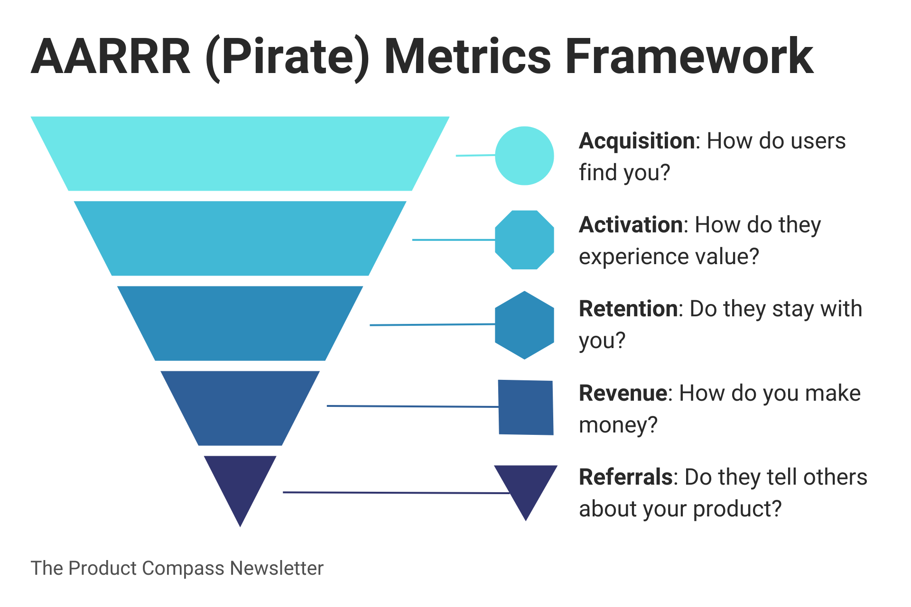
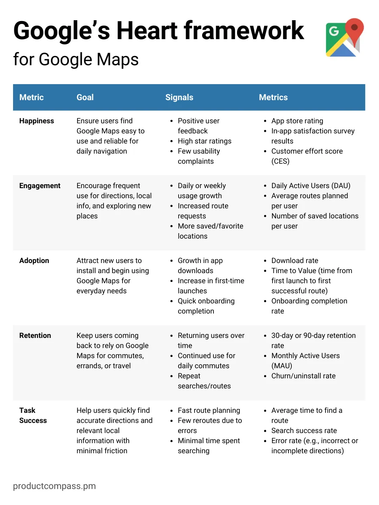
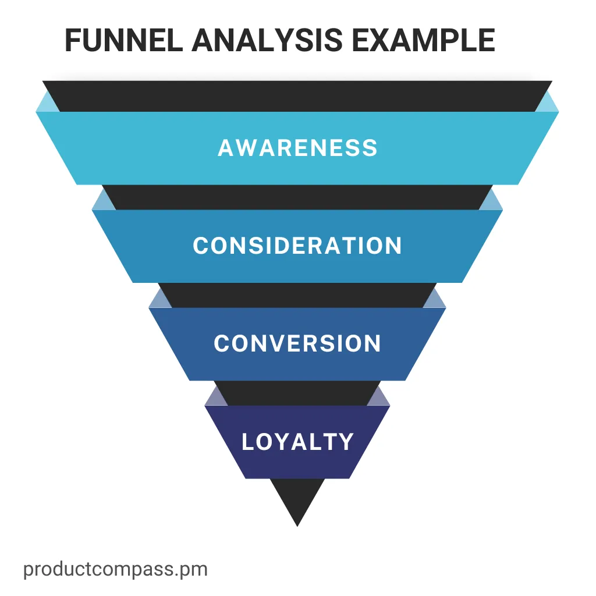

## معیار AARRR
 این معیار (metric) که به عنوان معیارهای دزدان دریایی نیز شناخته می‌شود، مخفف جذب (Acquisition)، فعال‌سازی (Activation)، حفظ (Retention)، درآمد (Revenue) و ارجاع (Referral) است.

این یک چارچوب ساده است که هر مرحله از قیف رشد شما را پوشش می‌دهد. این معیارها می‌توانند به شما کمک کنند تا تجربه کاربری را بهبود بخشید و چرخه عمر مشتری را بهینه‌سازی کنید.

> به یاد داشته باشید که: شما نمی‌توانید همه چیز را ردیابی کنید. بر روی چند شاخص کلیدی که بیشترین اهمیت را برای محصول شما دارند، تمرکز کنید.

### ۱. جذب (Acquisition)

جذب، نحوه‌ی **جلب کاربران یا مشتریان جدید** را نشان می‌دهد.

**معیارهای کلیدی:**
- هزینه جذب مشتری (Customer Acquisition Cost - CAC)
- هزینه به‌دست آوردن هر مشتری (Cost Per Acquisition - CPA)
- نرخ پرش (Bounce Rate)
- نرخ کلیک (Click-Through Rate - CTR)

**مثال:** اگر شما یک **اپلیکیشن یادگیری زبان** دارید، می‌توانید ثبت‌نام‌های حاصل از تبلیغات فیسبوک را پیگیری کنید. بررسی کنید که چه تعداد از این کاربران پس از دیدن تبلیغ ثبت‌نام می‌کنند. این داده‌ها را با تعداد ثبت‌نام‌های به دست‌ آمده از طریق **پست‌های وبلاگ سئو شده** مقایسه کنید. اگر هزینه تبلیغات بیشتر از درآمد حاصل از هر کاربر جدید باشد، هزینه جذب مشتری (CAC) شما بیش از حد بالاست.

**توصیه:** بر کانال‌هایی تمرکز کنید که **مخاطبان مناسبی** را جذب می‌کنند، نه فقط تعداد زیادی کاربر.

برای مثال، من می‌توانم در **پلتفرم X (توییتر سابق)** درباره موضوعات **محبوب و بحث‌برانگیز** مانند سیاست صحبت کنم و لینک این خبرنامه را به اشتراک بگذارم. اما این کار کمکی به **انتخاب مخاطبان مناسب** نخواهد کرد.

### ۲. فعال‌سازی (Activation)

فعال‌سازی زمانی رخ می‌دهد که یک کاربر برای نخستین بار **ارزش اصلی محصول شما را درک کرده و با آن تعامل برقرار می‌کند.**

**معیارهای کلیدی:**
- زمان تا ارزش (Time to Value - TTV)
- نرخ تکمیل فرآیند راه‌اندازی (Onboarding Completion Rate)
- نرخ تبدیل از نسخه آزمایشی به پرداختی (Trial-to-Paid Conversion Rate)
- نرخ فعال‌سازی کاربر (User Activation Rate)
- نرخ پذیرش ویژگی‌ها (Feature Adoption Rate)

**مثال:** برای یک **محصول SaaS در حوزه B2B**، می‌توان بررسی کرد که یک کاربر جدید چقدر سریع به یک نقطه عطف کلیدی در فعال‌سازی می‌رسد، مانند ادغام موفقیت‌آمیز CRM خود و مشاهده‌ی بینش‌های قابل اجرا. اگر ۶۰٪ از کاربران این مرحله را در هفته نخست تکمیل کنند، اما ۴۰٪ آن را رها کنند، ممکن است لازم باشد فرآیند را ساده‌تر کنید یا راهنمایی بهتری ارائه دهید.

**توصیه:** یک فرآیند فعال‌سازی **ساده و روان**، احتمال **تعامل بیشتر و حفظ کاربر در آینده** را افزایش می‌دهد.

### ۳. حفظ کاربر (Retention)

حفظ کاربر اندازه‌گیری می‌کند که چه تعداد از کاربران در طول زمان همچنان با ارزش اصلی محصول شما درگیر می‌مانند.

**معیارهای کلیدی:**
- نرخ ریزش (Churn Rate)
- نرخ حفظ کاربر (Retention Rate) در بازه‌های مختلف (۱ روزه، ۷ روزه، ۳۰ روزه و غیره)
- حفظ کاربران بر اساس گروه‌های زمانی (Cohort Retention)
- نرخ تمدید کاربر (User Renewal Rate) برای اشتراک‌ها
- حفظ ویژگی‌ها (Feature Retention) – آیا کاربران به استفاده از ویژگی‌های کلیدی ادامه می‌دهند؟

**مثال:** فرض کنید ۱۰۰ نفر در ماه ژانویه در اپلیکیشن فیتنس اشتراکی شما ثبت‌نام کنند. تا ماه مارس، چند نفر هنوز به انجام تمرینات ادامه می‌دهند؟ اگر ۵۰ نفر همچنان فعال باشند، نرخ حفظ کاربران شما در دو ماه، ۵۰٪ است.

**توصیه:** حفظ کاربر بالا معمولاً به این معنی است که کاربران به‌طور مداوم از محصول شما ارزش دریافت می‌کنند. به‌جای تمرکز صرف بر ترفندهای کوتاه‌مدت برای افزایش نرخ تبدیل، بر روی موارد زیر تمرکز کنید:
- ارائه‌ی ارزش تکرارشونده که به معیار اصلی (North Star Metric) شما مرتبط باشد. (مثلاً در یک اپلیکیشن فیتنس، "تعداد تمرینات تکمیل‌شده" می‌تواند معیار اصلی باشد.)
- کاهش موانع برای تعامل مجدد کاربران. (مانند تمرینات سریع و قابل شروع فوری که ورود مجدد کاربران را ساده‌تر می‌کند.)
- ویژگی‌هایی که به کاربران کمک می‌کند پیشرفت خود را دنبال کرده و انگیزه بگیرند. (مانند داشبورد پیشرفت، یادآوری‌های شخصی‌سازی‌شده، یا امکان اشتراک‌گذاری اجتماعی.)

### ۴. درآمد (Revenue)

درآمد اندازه‌گیری می‌کند که محصول شما چقدر درآمد ایجاد می‌کند و چگونه در طول زمان مقیاس‌پذیر است.

**معیارهای کلیدی:**
- درآمد ماهانه تکرارشونده (Monthly Recurring Revenue - MRR)
- درآمد سالانه تکرارشونده (Annual Recurring Revenue - ARR)
- ارزش طول عمر مشتری (Customer Lifetime Value - LTV)
- درآمد افزایشی (Expansion Revenue)، رشد MRR / ARR (افزایش درآمد تکرارشونده)
- نسبت LTV به CAC (پایداری درآمد)
- درآمد افزایشی از فروش بیشتر (Upsells, Cross-sells)
- ریزش درآمد (Revenue Churn) – از دست دادن درآمد ناشی از لغو اشتراک‌ها

**مثال:** اگر یک سرویس SaaS با طرح‌های (plans) چندسطحی دارید، بررسی کنید که چند کاربر در هر ماه طرح خود را ارتقا، تنزل، یا لغو می‌کنند. فرض کنید MRR شما در یک ماه ۱۰,۰۰۰ دلار باشد و در ماه بعد به ۱۲,۰۰۰ دلار برسد، در این صورت ۲,۰۰۰ دلار به MRR خالص شما اضافه شده است. اما اگر حساب‌های باارزش بالا لغو شوند، ممکن است با وجود ارتقاهای جدید، درآمد خالص شما کاهش یابد.

**توصیه:** بین **درآمد ناخالص و هزینه‌ها** تعادل برقرار کنید تا بیش از حد برای جذب مشتری هزینه نکنید. در حالی که معیارها را ساده‌سازی می‌کنیم، هدف نهایی فقط افزایش درآمد نیست، بلکه رسیدن به سودآوری پایدار است.

### ۵. ارجاع (Referral)

ارجاع زمانی رخ می‌دهد که کاربران فعلی، کاربران جدیدی را جذب می‌کنند، معمولاً از طریق بازاریابی دهان‌به‌دهان یا برنامه‌های تشویقی.

**معیارهای کلیدی:**
- ضریب ویروسی (Virality Coefficient) – هر کاربر فعلی به طور متوسط چند کاربر جدید را جذب می‌کند.
- نرخ تبدیل ارجاع (Referral Conversion Rate) – درصد کاربران ارجاع‌شده‌ای که ثبت‌نام می‌کنند.
- نرخ ارجاع مشتری (Customer Referral Rate) – درصد کاربران فعلی که دیگران را معرفی می‌کنند.
- برخی از شرکت‌ها از NPS (شاخص خالص ترویج‌کنندگان) به‌عنوان یک معیار کمکی استفاده می‌کنند، اما این موضوع بحث‌برانگیز است. من ترجیح می‌دهم رفتار واقعی مشتری را اندازه‌گیری کنم.

**مثال:** یک برنامه ارجاع راه‌اندازی کنید که هم به فرد ارجاع‌دهنده و هم به کاربر جدید پاداش دهد، مانند اعتبار رایگان. سپس بررسی کنید که چند ثبت‌نام از طریق لینک‌های اشتراکی انجام شده است و آیا این کاربران جدید فعال می‌شوند یا خیر. اگر ضریب ویروسی شما بالای ۱ باشد، پایگاه کاربری شما می‌تواند به‌صورت تصاعدی رشد کند، بدون نیاز به هزینه‌های اضافی بازاریابی.

**توصیه:** ارجاعات می‌توانند یک کانال رشد قدرتمند و کم‌هزینه باشند، به‌ویژه برای محصولاتی که دارای اثر شبکه‌ای داخلی هستند. اما اجرای آن‌ها چالش‌برانگیز است. باید ارزش منحصربه‌فرد و روشنی ارائه دهید که کاربران بخواهند آن را به اشتراک بگذارند.

یک راهبرد (strategy) ارجاع عالی باعث می‌شود محصول با به اشتراک‌گذاری مفیدتر شود. (Dropbox با ارائه فضای ذخیره‌سازی اضافی برای ارجاع‌ها، انگیزه‌ای قوی برای اشتراک‌گذاری ایجاد کرد.) یا مشوق‌های قوی برای انتشار محصول در نظر بگیرید.
[منبع](https://www.productcompass.pm/p/aarrr-pirate-metrics)

## چارچوب HEART گوگل

در رشد مبتنی بر محصول، تجربه‌ی کاربری عامل کلیدی است. اما چگونه می‌توان "رضایت کاربر" را که ذهنی است، اندازه‌گیری کرد؟ چارچوب HEART گوگل به این موضوع کمک می‌کند.

این چارچوب که توسط **تیم تحقیقاتی UX گوگل** ایجاد شده، مخفف رضایت  (Happiness)، مشارکت (Engagement)، پذیرش (Adoption)، حفظ (Retention)، و موفقیت در انجام وظیفه (Task Success) است. این یک روش ساده برای **ردیابی تجربه‌ی کاربری (UX) محصول شما** محسوب می‌شود.

> به داشته باشید که: داده‌ها تنها زمانی مفید هستند که منجر به تصمیمات بهتر شوند. به جای ردیابی همه‌چیز، روی چند معیار کلیدی که با راهبرد و اهداف شما هماهنگ هستند، تمرکز کنید.

### ۱. رضایت (Happiness)

نگرش یا میزان رضایت کاربر. این یک معیار ذهنی است و معمولاً از طریق نظرسنجی‌ها یا بازخوردهای (feedback) درون‌برنامه‌ای اندازه‌گیری می‌شود.

**مثال:** در یک پلتفرم SaaS، می‌توانید پس از تکمیل یک نقطه عطف کلیدی، یک نظرسنجی سریع برای کاربران ارسال کنید. امتیازات بالای رضایت معمولاً پیش‌بینی‌کننده‌ی تبلیغ دهان‌به‌دهان قوی هستند.

**توصیه:** تغییرات در رضایت کاربر را در کنار سایر معیارها پیگیری کنید. کاهش کوتاه‌مدت احساسات ممکن است بحرانی نباشد، اما افت طولانی‌مدت نشان‌دهنده‌ی مشکلات عمیق‌تر است.

### ۲. مشارکت (Engagement)

میزان و عمق تعامل کاربران با محصول شما.

**مثال:** در یک پلتفرم streaming، مجموع زمان تماشا یا تعداد جلسات مشاهده‌ی روزانه می‌تواند معیار مشارکت باشد. در یک ابزار همکاری، این معیار می‌تواند تعداد اسناد ایجادشده در هفته باشد.

**توصیه:** روی مشارکت معنادار تمرکز کنید. افزایش زمان صرف‌شده در یک صفحه همیشه نشانه‌ی خوبی نیست، زیرا ممکن است کاربران دچار سردرگمی شده باشند. مشارکت را به ارزش واقعی برای کاربران و کسب‌وکار گره بزنید.

### ۳. پذیرش (Adoption)

تعداد کاربران (یا مشتریان) جدید در طول زمان. این می‌تواند به معنای سرعت پذیرش ویژگی‌های جدید توسط کاربران نیز باشد.

**مثال:** اگر یک دوره آزمایشی رایگان ارائه می‌دهید، پیگیری کنید که چند نفر از ثبت‌نام‌ها به مشتریان پرداخت‌کننده تبدیل می‌شوند. برای رشد مبتنی بر محصول، زمان رسیدن به ارزش (Time to Value یا TTV) را اندازه‌گیری کنید—زمانی که طول می‌کشد تا کاربران مزیت اصلی محصول شما را تجربه کنند.

**توصیه:** اصطکاک در فرآیند onboarding (راه‌اندازی) را کاهش دهید. کاری کنید که کاربران سریع‌تر به ارزش محصول دست یابند. اگر کاربران جدید به سرعت مزیت محصول را ببینند (لحظه "آها" یا Aha moment)، احتمال ماندن آن‌ها بیشتر می‌شود.

### ۴. حفظ کاربران (Retention)

میزان موفقیت محصول شما در نگه‌داشت کاربران در طول زمان. یک محصول "چسبنده" (sticky) به این معناست که کاربران به طور منظم بازمی‌گردند.

**مثال:** اگر ۲۰۰ نفر در ژانویه ثبت‌نام کنند، چند نفر تا مارس همچنان از محصول شما استفاده می‌کنند؟ اگر ۱۲۰ نفر فعال باقی بمانند، نرخ حفظ شما ۶۰٪ است.

**توصیه:** حفظ کاربران اغلب با رضایت (Happiness) مرتبط است. اگر رضایت کاهش یابد، احتمالاً خروج کاربران (Churn) به زودی افزایش می‌یابد. کاربران را با ارائه ارزش واقعی درگیر نگه دارید، نه فقط با ترفندهای کوتاه‌مدت. (به عنوان مثال، لینکدین زمانی بازی‌هایی را معرفی کرد تا "ذهن شما را برای روز کاری آماده کند.")

### ۵. موفقیت در انجام وظایف (Task Success)

اندازه‌گیری میزان اثربخشی کاربران در تکمیل وظایف خاص. این شامل کارایی (مدت‌زمان انجام کار)، موثر بودن (تعداد وظایف تکمیل‌شده) و نرخ خطا می‌شود.

**مثال:** اگر در حال آزمایش یک ویژگی جدید هستید، می‌توانید وظیفه‌ای مانند ایجاد یک پروژه را به کاربران اختصاص دهید و بررسی کنید که چند نفر بدون خطا آن را تکمیل می‌کنند. سپس، نتایج را با یک معیار استاندارد یا محصول رقیب مقایسه کنید.

**توصیه:** می‌توانید تست‌های کاربردپذیری از راه دور را در مقیاس بزرگ انجام دهید، مثلاً با استفاده از Maze. معیارهای موفقیت در انجام وظایف را با بینش‌های کیفی مانند مصاحبه‌های کاربری ترکیب کنید تا بفهمید چرا کاربران دچار مشکل می‌شوند.

### نمونه

### چگونه چارچوب HEART را اجرا کنیم (۳ مرحله)

برای اجرای **چارچوب HEART گوگل** در عمل، این سه مرحله را دنبال کنید:

#### **مرحله ۱: تعیین اهداف (Goals)**
اهداف محصول یا ویژگی خود را مشخص کنید. نتایج موردنظر چیست؟
- آیا می‌خواهید فرآیند راه‌اندازی را بهبود دهید؟
- آیا می‌خواهید نرخ ریزش را کاهش دهید؟
- آیا هدف شما افزایش رضایت کاربران است؟

#### مرحله ۲: تعریف سیگنال‌ها (Signals)

تعیین کنید که کدام اقدامات کاربران نشان‌دهنده‌ی موفقیت یا شکست در رسیدن به هر هدف هستند. شکست‌ها، مانند وظایف نیمه‌کاره، معمولاً راحت‌تر از موفقیت‌ها قابل شناسایی هستند.

#### مرحله ۳: تعیین معیارها (Metrics)

این سیگنال‌ها را به معیارهای مشخص در چارچوب HEART مرتبط کنید. به عنوان مثال اگر هدف شما کاهش زمان راه‌اندازی (Onboarding) است، می‌توانید مدت‌زمان تکمیل راه‌اندازی (Task Success) یا رضایت کاربران در اولین استفاده (Happiness) را ردیابی کنید.

> هنگامی که تیم‌های گوگل از HEART استفاده می‌کنند، به بینش‌های مبتنی بر داده و کاربرمحور دست می‌یابند. شما نیز می‌توانید همین کار را انجام دهید، فقط این معیارها را متناسب با محصول و مخاطبان خود تنظیم کنید.

### پرسش‌های متداول (FAQ)

* چه کسی چارچوب HEART را ایجاد کرد؟
	* تیم تحقیقاتی UX گوگل (به رهبری کری رودن، هیلاری هاچینسون و زین فو) چارچوب HEART را برای اندازه‌گیری رضایت کاربران و موفقیت محصول توسعه دادند.
* آیا چارچوب HEART فقط برای تیم‌های UX است؟
	* خیر. مدیران محصول، طراحان و مهندسان نیز می‌توانند از معیارهای HEART برای تصمیم‌گیری‌های کاربرمحور استفاده کنند.
* آیا باید هر پنج معیار HEART را هم‌زمان دنبال کنم؟
	* نه لزوماً. بر روی معیارهایی تمرکز کنید که با اهداف فعلی شما همسو هستند و می‌توانید در طول زمان معیارهای بیشتری اضافه کنید.
* چگونه داده‌های رضایت کاربران (Happiness) را جمع‌آوری کنم؟
	* نظرسنجی‌ها مانند امتیاز رضایت مشتری (CSAT) و امتیاز تلاش مشتری (CES)، که معمولاً به‌صورت نظرسنجی‌های درون‌برنامه‌ای اجرا می‌شوند، می‌توانند میزان رضایت کاربران را اندازه‌گیری کنند. برای دریافت دیدگاه جامع‌تر، این داده‌ها را با سایر معیارها ترکیب کنید.
* آیا می‌توان موفقیت در انجام وظایف (Task Success) را با رقبا مقایسه کرد؟
	* بله، قطعاً! اجرای تست‌های کاربردپذیری روی هر دو محصول می‌تواند نشان دهد که در کجا عملکرد بهتری دارید و در چه بخش‌هایی ممکن است از رقبا عقب باشید.
[منبع](https://www.productcompass.pm/p/the-google-heart-framework)

## تحلیل قیف (Funnel Analysis)

تحلیل قیف (Funnel Analysis) روشی قدرتمند برای تصویری‌سازی هر مرحله‌ای است که کاربر در مسیر رسیدن به یک هدف خاص طی می‌کند، مانند خرید محصول یا ثبت‌نام در اشتراک.

> با ترسیم این مراحل، می‌توانید نقاطی را که کاربران در آن ریزش می‌کنند شناسایی کنید، دلیل آن را بفهمید و سپس برای بهبود نرخ تبدیل آزمایش‌هایی انجام دهید.

فرقی ندارد که یک پلتفرم SaaS در حوزه B2B را مدیریت می‌کنید یا یک سرویس استریمینگ در B2C؛ تحلیل قیف به شما کمک می‌کند روی معیارهای مهم تمرکز کنید و درگیر اعداد بی‌ارزش نشوید.

### تحلیل قیف چیست؟

قیف (Funnel) مجموعه‌ای از مراحلی است که کاربران از لحظه ورود به محصول شما (بالای قیف) تا انجام اقدام نهایی موردنظر شما (پایین قیف) طی می‌کنند.

**مراحل رایج در قیف:**
- آگاهی (Awareness): کاربران از طریق تبلیغات، جستجوی ارگانیک یا شبکه‌های اجتماعی با محصول شما آشنا می‌شوند.
- بررسی (Consideration): آن‌ها ویژگی‌ها را بررسی می‌کنند، نظرات کاربران را می‌خوانند یا طرح‌ها را مقایسه می‌کنند.
- تبدیل (Conversion): کاربران ثبت‌نام می‌کنند، خرید انجام می‌دهند یا اشتراک می‌گیرند.
- حفظ (Retention): آن‌ها در طول زمان به استفاده از محصول ادامه می‌دهند.

> قیف شما بسته به مدل کسب‌وکار ممکن است متفاوت باشد، اما اصل کلی ثابت است: هر مرحله را ردیابی کنید تا گلوگاه‌ها (bottlenecks) را شناسایی کنید.

### معیارهای کلیدی برای اندازه‌گیری

برخی از مهم‌ترین معیارها شامل موارد زیر هستند:
- **نرخ پرش (Bounce Rate):** درصد کاربرانی که بدون انجام هیچ اقدام بعدی، سایت را ترک می‌کنند. نرخ پرش بالا معمولاً نشان‌دهنده پیام‌رسانی نامشخص یا تجربه کاربری ضعیف است.
- **نرخ تبدیل (Conversion Rate):** درصد کاربرانی که یک اقدام موردنظر را تکمیل می‌کنند (مانند ثبت‌نام یا خرید). این مهم‌ترین معیار موفقیت قیف شما محسوب می‌شود.
- **نقاط ریزش (Drop-off Points):** مراحلی که کاربران در آن فرآیند را رها می‌کنند (مثلاً پس از افزودن محصول به سبد خرید اما قبل از پرداخت). شناسایی این نقاط به بهبود تجربه‌ی کاربر کمک می‌کند.
- **زمان تا ارزش (Time to Value - TTV):** مدت‌زمانی که طول می‌کشد تا کاربران جدید ارزش اصلی محصول را تجربه کنند. TTV سریع‌تر، احتمال حرکت کاربران در قیف را افزایش می‌دهد.

> روی معیارهایی تمرکز کنید که: قابل‌درک، قابل‌مقایسه، و قابل‌تغییر باشند. داده‌ها باید تصمیمات را هدایت کنند، نه اینکه فقط در گزارش‌ها انباشته شوند.

### نمونه

نتفلیکس به دلیل استفاده‌ی مؤثر از تحلیل قیف برای بهینه‌سازی فرآیند ورود کاربران و افزایش نرخ حفظ کاربر مشهور است. یکی از قیف‌های آن‌ها ممکن است به این شکل باشد:
- **صفحه فرود (Landing Page):** کاربران وارد سایت می‌شوند و پیشنهاد «نتفلیکس را رایگان امتحان کنید» یا  اشتراک را مشاهده می‌کنند.
- **انتخاب طرح (Plan Selection):** کاربران یکی از طرح‌ها را انتخاب می‌کنند (پایه، استاندارد، پریمیوم).
- **ثبت‌نام و پرداخت (Sign-up & Payment):** کاربران اطلاعات شخصی و پرداختی خود را وارد می‌کنند.
- **اولین تماشا (First Watch):** کاربران یک فیلم یا سریال را شروع به تماشا می‌کنند.
- **تمدید اشتراک (Recurring Subscription):** کاربران به عنوان اعضای پرداختی باقی می‌مانند.

فرض کنید نتفلیکس متوجه شود که بسیاری از کاربران در مرحله‌ی انتخاب طرح ریزش دارند، زیرا تفاوت بین طرح‌ها برایشان نامشخص است. با آزمایش توضیحات شفاف‌تر برای طرح‌ها و کاهش پیچیدگی انتخاب، نتفلیکس اصطکاک را کاهش داد و نرخ تبدیل را افزایش داد. آن‌ها همچنین «زمان تا اولین تماشا (TTV)» را به‌عنوان یک معیار کلیدی اندازه‌گیری کردند. هرچه کاربران سریع‌تر نخستین برنامه‌ی خود را تماشا کنند، احتمال ماندگاری طولانی‌مدت آن‌ها بیشتر خواهد بود.

### پنج نکته برای تحلیل مؤثر قیف

تحلیل قیف معمولاً به این صورت انجام می‌شود:
1. **مراحل خود را مشخص کنید (Map Your Stages):** مراحل کلیدی که می‌خواهید کاربران طی کنند را تعریف کنید. ساده نگه دارید.
2. **هر مرحله را ردیابی کنید (Track Each Step):** از ابزارهای تحلیل مانند Mixpanel، Google Analytics یا Amplitude برای ثبت تعداد کاربرانی که پیش می‌روند یا ریزش می‌کنند استفاده کنید.
3. **عمیق‌تر بررسی کنید (Dig Deeper):** اگر در یک مرحله ریزش قابل‌توجهی مشاهده کردید، علت را بررسی کنید. تحلیل داده‌های محصول به شما نشان می‌دهد چه اتفاقی افتاده است. اگر دلیل مشخص نبود، از روش‌های کیفی مانند مصاحبه‌ی کاربران برای فهمیدن **چرا** استفاده کنید.
4. **آزمایش کنید (Experiment):** ایده‌پردازی کنید، یک فرضیه بسازید، و در هر آزمایش فقط یک متغیر را تغییر دهید (مثلاً پیام‌های متنی، چیدمان صفحه) تا ببینید آیا نرخ تبدیل بهبود می‌یابد یا خیر.
5. **شاخص‌های پیشرو و پسرو را بررسی کنید (Monitor Leading vs. Lagging Indicators):** شاخص‌های پسرو مانند نرخ ریزش ماهانه که نشان می‌دهد چه اتفاقی افتاده است. شاخص‌های پیشرو مانند شکایات روزانه‌ی کاربران که می‌تواند ریزش آینده را پیش‌بینی کند.

### پرسش‌های متداول (FAQ)

**پرسش:** تفاوت بین تحلیل قیف و چارچوب AARRR چیست؟

تحلیل قیف بر جریان کاربران برای یک هدف خاص (مثلاً ثبت‌نام) تمرکز دارد. چارچوب AARRR پنج مرحله از چرخه‌ی عمر مشتری (جذب، فعال‌سازی، حفظ، درآمد، ارجاع) را پوشش می‌دهد تا یک نمای کلی از مسیر کاربر ارائه دهد. هر دو روش مکمل یکدیگر هستند.

**پرسش:** چند مرحله از قیف را باید ردیابی کنم؟

بستگی به محصول شما دارد. با یک قیف ساده شامل بالا، وسط و پایین قیف شروع کنید. در صورت نیاز، جزئیات بیشتری اضافه کنید، مانند تفکیک مراحل ثبت‌نام، پرداخت و فعال‌سازی.

**پرسش:** اگر قیف من مسیرهای کاربری متعددی داشته باشد چه کنم؟

قیف خود را بر اساس گروه‌های کاربری، منبع ترافیک یا نوع طرح تفکیک کنید. این کار به شما کمک می‌کند ببینید کدام گروه‌های کاربری بهتر تبدیل می‌شوند و اصطکاک در کدام بخش بیشتر است.

**پرسش:** چگونه باید با ریزش کاربران برخورد کنم؟

مرحله‌ای را که بیشترین ریزش دارد شناسایی کنید، یک فرضیه بسازید و آزمایشی اجرا کنید. مثلاً اگر در مرحله‌ی پرداخت کاربران را از دست می‌دهید، فرآیند پرداخت را ساده‌تر کنید یا گزینه‌ی پرداخت بدون ثبت‌نام (Guest Checkout) اضافه کنید.

**پرسش:** چگونه می‌توان موفقیت قیف را در طول زمان اندازه‌گیری کرد؟

نرخ‌های تبدیل را به‌صورت هفتگی یا ماهانه مقایسه کنید. بهبودهای مداوم یا تغییرات قابل‌توجه پس از به‌روزرسانی‌های محصول را بررسی کنید.

**پرسش:** مراحل قیف بازاریابی چه تفاوتی با قیف فروش دارند؟

برخی قیف بازاریابی و قیف فروش را جداگانه بررسی می‌کنند، اما اساس هر دو مشابه است. قیف بازاریابی معمولاً شامل آگاهی، علاقه، بررسی و قصد خرید است و بر جذب و پرورش سرنخ‌های فروش (Leads) تمرکز دارد. قیف فروش (بسته به B2B/B2C) شامل جذب مشتری، ارزیابی، پیشنهاد، مذاکره و نهایی‌سازی قرارداد است و بر تبدیل سرنخ به مشتری تمرکز دارد.

**پرسش:** سئو چگونه بر بالای قیف بازاریابی تأثیر می‌گذارد؟

سئو نقش کلیدی در مرحله‌ی آگاهی دارد زیرا از طریق کلمات کلیدی هدفمند و محتوای باکیفیت و قابل اشتراک‌گذاری، مشتریان بالقوه را به وب‌سایت شما جذب می‌کند. این مطلب دقیقاً نمونه‌ای از اجرای این تاکتیک در عمل است.

[منبع](https://www.productcompass.pm/p/funnel-analysis)

## تحلیل Cohort

تحلیل Cohort روشی قدرتمند برای **گروه‌بندی کاربران بر اساس ویژگی‌ها یا رفتارهای مشترک** و بررسی نحوه‌ی تغییر رفتار این گروه‌ها در طول زمان است.

به‌عنوان مثال، کاربران که در یک ماه خاص ثبت‌نام کرده‌اند یا یک مرحله‌ی خاص از راه‌اندازی (onboarding) را تکمیل کرده‌اند. با ردیابی هر Cohort، می‌توانید نقاط ریزش کاربران را شناسایی کنید و اقداماتی برای بهبود حفظ کاربر، کاهش نرخ ریزش و رشد محصول انجام دهید.

### تحلیل Cohort چیست؟

تحلیل Cohort کاربران را بر اساس یک ویژگی مشترک، مانند تاریخ ثبت‌نام یا یک اقدام کلیدی، گروه‌بندی می‌کند. سپس نحوه‌ی تغییر رفتار هر گروه در طول زمان ردیابی می‌شود.

**مثال:** اگر بخواهید بدانید چرا کاربران جدید پس از دو هفته استفاده از اپلیکیشن شما را کنار می‌گذارند، می‌توانید گروه «ثبت‌نام‌شدگان سپتامبر ۲۰۲۵» را بررسی کنید و ببینید فعالیت آن‌ها روزبه‌روز یا هفته به هفته چگونه تغییر می‌کند.

> چرا مهم است: این تحلیل نه‌تنها به شما می‌گوید "چه اتفاقی در حال رخ دادن است؟" بلکه "چه کسانی تحت تأثیر قرار گرفته‌اند؟" و "این مشکل از چه زمانی شروع شد؟" را هم مشخص می‌کند. این اطلاعات بسیار کاربردی‌تر از یک میانگین کلی است که همه‌ی کاربران را با هم ترکیب می‌کند.

### دو نوع Cohort

در تحلیل Cohort مشتریان، دو نوع Cohort اصلی وجود دارد:

1. Cohort جذب (Acquisition Cohorts)
- کاربران را بر اساس تاریخ ثبت‌نام گروه‌بندی می‌کند (مثلاً همه‌ی افرادی که در سپتامبر ثبت‌نام کرده‌اند).
- به شما کمک می‌کند ببینید آیا تغییرات در فرآیند راه‌اندازی (onboarding) یا بازاریابی در آن دوره بر نرخ حفظ یا نرخ ریزش تأثیر گذاشته است یا خیر.
1. Cohort رفتاری (Behavioral Cohorts)
- کاربران را بر اساس اقدامات درون‌برنامه‌ای گروه‌بندی می‌کند (مثلاً کاربرانی که راه‌اندازی را تکمیل کرده‌اند یا از یک ویژگی کلیدی استفاده کرده‌اند).
- مشخص می‌کند کدام رفتارها با نرخ حفظ بالاتر ارتباط دارند. به عنوان نمونه ممکن است ببینید کاربرانی که یک بازبینه (checklist) راه‌اندازی را تکمیل کرده‌اند، کمتر از کاربرانی که آن را رد کرده‌اند، دچار ریزش می‌شوند.

### مطالعه موردی نتفلیکس: «اپیزود جذب‌کننده»

در سال ۲۰۱۵، نتفلیکس به‌طور عمومی اعلام کرد که آن‌ها بررسی کرده‌اند چه زمانی بینندگان جدید «جذب» یک سریال می‌شوند، یعنی دقیقاً کدام اپیزود باعث می‌شود که کاربر کل فصل را تماشا کند.

نتفلیکس دریافت که، به‌عنوان مثال، بینندگانی که به اپیزود ۲ از Breaking Bad می‌رسند، احتمال بیشتری دارد که به تماشا ادامه دهند. بینندگانی که به اپیزود ۳ از House of Cards می‌رسند، بیشتر احتمال دارد که مشترک باقی بمانند.

بیایید این موضوع را تجزیه کنیم:

- تعریف Cohort: یکی از روش‌های بررسی این داده‌ها، در نظر گرفتن افرادی است که یک سریال جدید را در یک ماه (یا هفته) مشخص شروع کرده‌اند و گروه‌بندی آن‌ها به‌عنوان یک گروه (Cohort).
- رفتار ردیابی‌شده: نتفلیکس بررسی کرد که هر کاربر چند اپیزود تماشا کرده است و آن‌ها را بر اساس سریال و اپیزودی که در آن ادامه داده یا ریزش کرده‌اند، گروه‌بندی کرد.
- نتیجه: نتفلیکس دریافت که رسیدن به "اپیزود جذب‌کننده" ارتباط قوی‌ای با نرخ حفظ کاربران دارد. افرادی که به این اپیزود می‌رسند، کمتر احتمال دارد که اشتراک خود را لغو کنند.
- اقدامات انجام‌شده: این بینش‌ها، راهبرد نتفلیکس را شکل دادند:
	- پخش خودکار (Auto-Play): آن‌ها ویژگی پخش خودکار را بهبود دادند تا کاربران سریع‌تر از یک اپیزود به اپیزود بعدی منتقل شوند و راحت‌تر به «نقطه جذب» برسند.
	- توصیه‌های شخصی‌سازی‌شده (Personalized Recommendations): آن‌ها نمایش اپیزود بعدی یا سریال‌های مشابه را برجسته‌تر کردند تا کاربران به تماشای مداوم تشویق شوند.
	- سرمایه‌گذاری در محتوا (Content Investment): آن‌ها روی تولید یا خرید سریال‌هایی که پتانسیل جذب بالایی دارند، بیشتر سرمایه‌گذاری کردند.

با استفاده از تحلیل Cohort نرخ حفظ (retention)، نتفلیکس اطمینان حاصل کرد که کاربران پس از رسیدن به اپیزود جذب‌کننده، نرخ ریزش کمتری دارند. نتفلیکس همچنان از این بینش‌های مبتنی بر داده برای بهینه‌سازی نمایش محتوا به بینندگان جدید استفاده کرد، که در نهایت منجر به افزایش نرخ حفظ و ارزش طول عمر مشتری (CLV) شد.

### اجرای تحلیل Cohort

تحلیل Cohort نسبتاً ساده است. مراحل اصلی به شرح زیر است:

1. پرسش خود را مشخص کنید (Define Your Question): آیا در حال بررسی نرخ ریزش، پذیرش یک ویژگی جدید، یا موفقیت فرآیند راه‌اندازی (onboarding) هستید؟
2. نوع Cohort را انتخاب کنید (Pick a Cohort Type): مبتنی بر زمان (Time-based)، کاربران را بر اساس تاریخ ثبت‌نام (Cohort جذب) گروه‌بندی کنید. یا مبتنی بر رفتار (Action-based)، کاربران را بر اساس اقدامات درون‌برنامه‌ای (Cohort رفتاری) دسته‌بندی کنید.
3. تغییرات را در طول زمان ردیابی کنید (Track Over Time): از ابزارهای تحلیلی مانند Mixpanel یا Amplitude استفاده کنید یا داشبوردهای سفارشی ایجاد کنید. بررسی کنید که چند کاربر همچنان فعال هستند یا مرحله‌ی بعدی را تکمیل می‌کنند (به‌صورت روزانه، هفتگی یا ماهانه).
4. الگوها را شناسایی کنید (Identify Patterns): به دنبال افت‌های شدید یا تغییرات ناگهانی باشید. بررسی کنید که آیا یک ویژگی جدید یا یک کمپین بازاریابی خاص با این تغییرات ارتباط دارد.
5. اقدام کنید (Take Action): یک فرضیه بسازید، آزمایش انجام دهید، و بررسی کنید که آیا Cohortها بهبود پیدا می‌کنند. این فرآیند را تکرار کنید تا بهبودهای پایداری مشاهده کنید.

### چهار بهترین روش برای اجرای تحلیل Cohort

هنگام انجام تحلیل Cohort، این نکات را در نظر بگیرید:

- **روی شاخص‌های پیشرو تمرکز کنید (Prioritize Leading Indicators):** اگر در مراحل اولیه افزایش شکایات کاربران را مشاهده کنید، ممکن است این موضوع ریزش آینده را پیش‌بینی کند.
- **بینش‌های کیفی را ترکیب کنید (Combine Qualitative Insights):** با کاربران در Cohortهایی که ریزش کرده‌اند صحبت کنید. نظرسنجی‌ها و مصاحبه‌ها می‌توانند دلیل واقعی ترک کاربران را مشخص کنند.
- **از معیارهای بیهوده پرهیز کنید (Avoid Vanity Metrics):** داشتن تعداد زیاد کاربران مهم نیست، اگر آن‌ها ماندگار نباشند. تحلیل Cohort بر حفظ کاربر تأکید دارد، که اقدامی‌تر و کاربردی‌تر است.
- **به‌طور مداوم تکرار و بهبود دهید (Iterate Constantly):** هنگامی که یک مشکل را حل کنید، Cohortها می‌توانند مشکلات جدیدی را آشکار کنند. به ردیابی و بهبود ادامه دهید.

### پرسش‌های متداول (FAQ)

**پرسش:** تفاوت بین تحلیل کوهورت و تحلیل قیف چیست؟

تحلیل قیف نشان می‌دهد که کاربران چگونه از طریق مراحل خاصی (مثلاً از ثبت‌نام تا خرید) حرکت می‌کنند. تحلیل Cohort کاربران را بر اساس یک ویژگی مشترک در طول زمان گروه‌بندی می‌کند.

در عمل، این دو روش اغلب مکمل یکدیگر هستند. از تحلیل قیف برای یافتن نقاط ریزش استفاده کنید. سپس از تحلیل Cohort برای بررسی رفتار گروه‌های مختلف کاربران بهره ببرید.

**پرسش:** باید با Cohortهای جذب (Acquisition) شروع کنم یا رفتاری (Behavioral)؟

Cohortهای جذب برای شروع آسان‌تر هستند (مثلاً «همه‌ی کاربرانی که در اکتبر ثبت‌نام کرده‌اند»). Cohortهای رفتاری اطلاعات عمیق‌تری درباره‌ی دلایل ریزش کاربران ارائه می‌دهند.

بسیاری از تیم‌های محصول از هر دو روش استفاده می‌کنند.

**پرسش:** چگونه بازه‌های زمانی مناسب را انتخاب کنم؟

اگر محصول شما تعامل روزانه دارد (مثلاً یک اپلیکیشن پیام‌رسان)، Cohortها را بر اساس روز یا هفته ردیابی کنید. برای SaaS B2B با اشتراک‌های ماهانه، بازه‌های ماهانه منطقی‌تر هستند.

**پرسش:** آیا تحلیل Cohort می‌تواند به افزایش فروش (Upsells) کمک کند؟

بله! این یکی از کاربردهای اصلی تحلیل Cohort است. با گروه‌بندی کاربرانی که طرح (plan) خود را ارتقا داده‌اند یا افزونه‌ای خریداری کرده‌اند، می‌توانید بفهمید که کدام رفتارها (مثلاً استفاده‌ی مکرر از یک ویژگی) باعث افزایش فروش شده است. سپس می‌توانید سفر کاربری را برای تشویق این رفتارها بهینه کنید.

**پرسش:** به چه ابزارهایی نیاز دارم؟

پلتفرم‌های تحلیلی محبوب مانند Mixpanel، Amplitude یا Google Analytics می‌توانند گزارش‌های Cohort ایجاد کنند. تحلیل‌گران داده می‌توانند گزارش‌های سفارشی را با Microsoft Business Intelligence، Google BigQuery (SQL-like)، Tableau یا حتی صفحات گسترده (spreadsheets) بسازند، هرچند این روش زمان‌برتر است.

[منبع](https://www.productcompass.pm/p/cohort-analysis)
