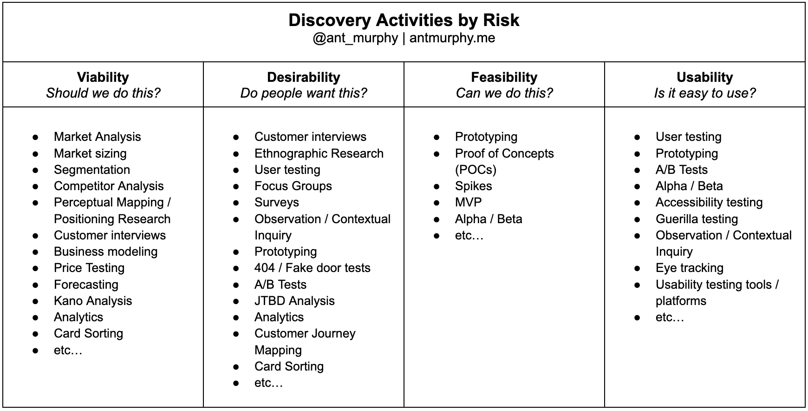

[منبع](https://www.antmurphy.me/newsletter/product-discovery-activities-by-risk)
کشف محصول یک فعالیت برای کاهش ریسک است. به طور مشخص‌تر، ما سه ریسک اصلی را کاهش می‌دهیم:
- مطلوبیت (Desirability)
- قابلیت اجرا (Viability)
- امکان‌پذیری (Feasibility)

می‌توان این موارد را به زیرمجموعه‌هایی مانند کاربردپذیری (usability)، اخلاقی بودن (ethical)، پایداری (sustainable)، ارزشمندی (valuable) و غیره تقسیم کرد. اما همه این‌ها در نهایت زیر یکی یا چند مورد از این سه دسته قرار می‌گیرند.

برای کمک به تعیین ریسک‌هایمان، به مفروضات خود نگاه می‌کنیم. پشت هر ایده‌ای مجموعه‌ای از مفروضات و باورها وجود دارد که باعث شده فکر کنیم این مشکل ارزش حل کردن را دارد و این راه‌حل قابل قبول است. مفروضاتی که بررسی نشده‌اند، ریسک هستند. برخی مفروضات از سایرین خطرناک‌تر هستند. اگر در مورد آن‌ها اشتباه کنیم، کل ایده ما شکست خواهد خورد. پس باید در کشف محصول تمرکز ما بر روی این «مفروضات پرخطر» باشد.

بنابراین، آنچه در کشف محصول انجام می‌دهید، بر اساس مفروضاتی است که نیاز به آزمایش دارند (که همان مفروضات پرخطر شما هستند). مشکل این است که پاسخ "بستگی دارد" کمکی نمی‌کند.

- ریسک قابلیت دوام (Viability Risk)
	- تحلیل بازار
	- اندازه‌گیری بازار
	- بخش‌بندی بازار (Segmentation)
	- تحلیل رقبا
	- نقشه‌برداری ادراکی / تحقیق موقعیت‌یابی (Perceptual Mapping / Positioning Research)
	- مصاحبه با مشتریان
	- مدل‌سازی کسب‌وکار
	- تست قیمت‌گذاری
	- پیش‌بینی
	- تحلیل کانو (Kano Analysis)
	- تحلیل داده‌ها
	- و غیره...
- ریسک مطلوبیت (Desirability Risk)
	- مصاحبه با مشتریان
	- تحقیق قوم‌نگاری (Ethnographic Research)
	- تست کاربری
	- گروه‌های متمرکز (Focus Groups)
	- نظرسنجی‌ها
	- مشاهده / تحقیق زمینه‌ای
	- نمونه‌سازی (Prototyping)
	- تست‌های جعلی (404 / Fake door tests)
	- تست‌های A/B
	- تحلیل کار به‌انجام‌رسیدنی (JTBD Analysis)
	- تحلیل داده‌ها
	- نقشه‌برداری مسیر مشتری
	- و غیره...
- ریسک قابلیت اجرایی (Feasibility Risk)
	- نمونه‌سازی (Prototyping)
	- مدارک مفهومی (Proof of Concepts - POCs)
	- اسپایک‌ها (Spikes)
	- حداقل محصول قابل‌ارائه (MVP)
	- نسخه‌های آلفا / بتا
	- و غیره...
- ریسک کاربردپذیری (Usability Risk)
	- تست کاربری (User testing)
	- نمونه‌سازی
	- تست‌های A/B
	- نسخه‌های آلفا / بتا
	- تست دسترسی‌پذیری (Accessibility Testing)
	- تست‌های چریکی (Guerilla Testing)
	- مشاهده / تحقیق زمینه‌ای (Observation / Contextual Inquiry)
	- ردیابی چشم (Eye Tracking)
	- پلتفرم‌ها / ابزارهای تست کاربردپذیری (مانند User Testing.com)
	- و غیره...

> دقت شودکه فهرست بالا یک فهرست "نهایی" یا لیست فعالیت‌های "الزامی" نیست. این فهرست جامع هم نیست.

می‌توان با یکی از این چهار مورد شروع کنید:
- مصاحبه با مشتری
- نمونه‌سازی و تست کاربری
- نظرسنجی
- جمع‌آوری و تحلیل داده‌ها

در بیشتر موارد، موقعیت خوبی خواهید داشت اگر:
- با مشتریانتان صحبت کنید.
- چیزی را در مقابل آن‌ها قرار دهید (نمونه اولیه).
- یا از طریق نظرسنجی یا تحلیل داده‌های موجود خود، اطلاعات بیشتری جمع‌آوری کنید.

یک خطر واقعی در صرف وقت بیش از حد برای انتخاب آزمایشی "کامل" وجود دارد که بهترین نتایج را به شما بدهد. اما کیفیت باید با سرعت تعدیل شود. من به عملگرایی تمایل دارم، اما مطمئنم که موافق خواهید بود که سرعت با داده‌های ناقص معمولاً بهتر از منتظر ماندن برای داده‌های کامل است.
