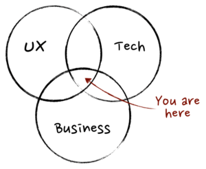

# مدیریت محصول

در این سند به **مدیریت محصول در چارچوب چابک (Agile)** به اصول کلیدی و روش‌های اصلی این حوزه می‌پردازدیم. [منبع](https://www.atlassian.com/agile/product-management)

مدیریت محصول یک عملکرد سازمانی است که هر مرحله از چرخه عمر محصول - از توسعه گرفته تا تعیین وضعیت و قیمت‌گذاری - را با تمرکز بر محصول و در درجه اول و مهم‌تر از همه مشتریان هدایت می‌کند. 

برای ساخت بهترین محصول ممکن، مدیران محصول درون سازمان از مشتریان حمایت می‌کنند و مطمئن می‌شوند که صدای بازار شنیده می‌شود و مورد توجه قرار می‌گیرد. همچین نیاز به درک نزدیک از مشتریان و توانایی ایجاد راه‌حل‌های مناسب برای این کار ضروری می‌باشد.

دقت داشته باشید که هیچ راهی برای اعمال اصول مدیریت محصول وجود ندارد. هر محصولی اهداف و چالش‌های خاص خود را دارد که نیازمند یک رویکرد منحصربه‌فرد و سفارشی برای مدیریت محصول است. [مارتین اریکسون](https://www.mindtheproduct.com/what-exactly-is-a-product-manager) مدیریت محصول را به عنوان نقطه تلاقی کسب‌وکار، تجربه کاربر و فناوری توصیف می‌کند.
- کسب‌وکار - مدیریت محصول به تیم‌ها کمک می‌کند تا با پر کردن شکاف ارتباطی بین توسعه‌دهنده، طراحی، مشتری و کسب‌وکار به اهداف تجاری خود برسند.
- تجربه کاربر - مدیریت محصول بر تجربه کاربر تمرکز دارد و نشان دهنده مشتری در داخل سازمان است. UX عالی نحوه این تمرکز را آشکار می‌کند.
- فناوری - مدیریت محصول، هر روز در بخش مهندسی اتفاق می‌افتد. درک کامل علوم کامپیوتر بسیار مهم است.

مدیریت محصول چابک ترکیبی از اصول توسعه چابک و نظارت راهبردی بر چرخه‌های عمر محصول است. این رویکرد بر تحویل تدریجی، بازخورد مشتریان و سازگاری با تغییرات بازار تمرکز دارد. یکی از مفاهیم اصلی در چابک این است که محدوده یک پروژه سیال است، در حالی که منابع ثابت می‌مانند. به این ترتیب، در مدیریت محصول چابک، تیم زمان کمتری را برای تعریف محصول از قبل صرف می‌کند و در طول مسیر آماده تغییرات است.

## فرآیند مدیریت محصول
فرآیند مدیریت محصول را می‌توان در گام‌های زیر خلاصه کرد: [منبع](https://www.productplan.com/learn/what-is-product-management)

### تعریف مشکل
همه‌چیز با شناسایی یک مشکل مهم (نقطه درد) مشتری آغاز می‌شود. در این مرحله، افراد یا سازمان‌ها در تلاش هستند کاری را انجام دهند اما نمی‌توانند یا اگر بتوانند، این کار بسیار هزینه‌بر، زمان‌بر، پرمصرف، ناکارآمد، یا ناخوشایند است.

مدیریت محصول این شکایات، خواسته‌ها و آرزوهای انتزاعی را به یک بیانیه مشکل تبدیل می‌کند که به دنبال یک راه‌حل است. حل این مشکل و کاهش این درد، جرقه و انگیزه‌ای است که همه چیز را به حرکت درمی‌آورد. بدون یک هدف مشخص که مستقیماً این مشکل را برطرف کند، امید زیادی برای موفقیت یا ماندگاری محصول وجود ندارد.

### کمی‌سازی فرصت
مشکلات و نقاط درد زیادی وجود دارند، اما همه آن‌ها ارزش حل‌کردن ندارند. اینجا جایی است که مدیران محصول کلاه مشتری‌محور خود را کنار می‌گذارند و دیدگاه تجاری خود را به کار می‌گیرند.

برای توجیه سرمایه‌گذاری در ساخت یک محصول یا راه‌حل جدید، مدیریت محصول باید به پرسش‌های زیر پاسخ دهد و بتواند براساس پاسخ‌های به‌دست‌آمده یک پرونده تجاری قوی بسازد:
- **اندازه بازار قابل دستیابی چقدر است؟**
- **آیا مشکل یا نقطه درد آنقدر جدی است که مردم به فکر استفاده از راه‌حل‌های جایگزین باشند؟**
- **آیا حاضرند برای راه‌حل جایگزین هزینه کنند (یا آیا راه دیگری برای کسب درآمد از این راه‌حل وجود دارد)؟**

### تحقیق در مورد راه‌حل‌های بالقوه
با داشتن هدف مشخص، مدیریت محصول می‌تواند به طور کامل بررسی کند که چگونه ممکن است مشکلات و نقاط درد مشتریان را حل کند. در این مرحله، باید طیف گسترده‌ای از راه‌حل‌های ممکن در نظر گرفته شود و نباید به سرعت هیچ ایده‌ای را رد کرد.

با این حال، این به معنای شروع به تدوین الزامات و همکاری فوری با تیم توسعه محصول نیست. ابتدا باید این ایده‌ها با بازار هدف اعتبارسنجی شوند، اگرچه مشورت با تیم فنی برای اطمینان از امکان‌پذیری اولیه ایده‌ها منطقی است. مدیران محصول اغلب برای بررسی میزان علاقه گروه‌های هدف، شخصیت‌هایی (Personas) ایجاد می‌کنند و ایده‌های پیشنهادی را با آن‌ها تطبیق می‌دهند.

نادیده گرفتن این مرحله و مستقیماً وارد مرحله ساختن چیزی شدن، می‌تواند اشتباهی بزرگ یا موجب تأخیرهای جدی شود. در حالی که هیچ تضمینی وجود ندارد، تأیید گرفتن از مشتریان بالقوه مبنی بر اینکه ایده مورد نظر چیزی است که می‌خواهند، استفاده می‌کنند و حاضرند برای آن هزینه کنند، یک گام اساسی در کل فرآیند و دستیابی به تناسب محصول با بازار (Product-Market Fit) است.

### ساخت یک محصول حداقلی قابل قبول (MVP)
پس از اعتبارسنجی جذابیت و امکان‌پذیری یک راه‌حل خاص، زمان آن رسیده است که تیم توسعه محصول به طور جدی وارد عمل شود. ابتدا باید مجموعه حداقلی از قابلیت‌های ضروری تعریف شود. سپس تیم می‌تواند یک نسخه اولیه از محصول را ایجاد کند که قابل آزمایش با کاربران واقعی باشد.

بسیاری از قابلیت‌های اضافی عمداً از محصول حداقلی قابل قبول حذف می‌شوند، زیرا هدف اصلی اطمینان از این است که عملکرد اصلی نیازهای بازار را برآورده می‌کند. ویژگی‌های جانبی می‌توانند در مراحل بعدی چرخه عمر محصول اضافه شوند، چرا که صرف منابع اضافی روی یک محصول اثبات‌نشده ارزش چندانی ندارد.

محصول حداقلی قابل قبول (MVP) نه تنها عملکرد محصول را آزمایش می‌کند بلکه پیام‌رسانی و موقعیت‌یابی ارزش پیشنهادی را نیز با همکاری بازاریابی محصول بررسی می‌کند. نکته کلیدی این است که مشخص شود آیا این محصول ابتدایی چیزی است که بازار به آن نیاز دارد و آیا می‌تواند به‌طور کافی نیازهای اصلی آن را برآورده کند یا خیر.

### ایجاد یک حلقه بازخورد
بازخورد مشتری در تمام مراحل چرخه عمر محصول ضروری است، اما هیچ زمانی به اندازه معرفی محصول حداقلی قابل قبول (MVP) اهمیت ندارد. در این مرحله، تیم مدیریت محصول می‌تواند یاد بگیرد که مشتریان چه فکر می‌کنند، چه نیازهایی دارند، و از چه چیزهایی ناراضی هستند، زیرا آن‌ها به تجربه واقعی محصول واکنش نشان می‌دهند و نه ایده‌های نظری مطرح شده در مکالمات.

مدیریت محصول باید فرآیند ارائه بازخورد را برای مشتریان ساده کند و از طریق درخواست‌های مکرر بازخورد، اطلاعات ارزشمندی جمع‌آوری کند. به همان اندازه مهم است که این بازخورد پردازش، تحلیل و به ایده‌های قابل اجرا تبدیل شود و در نقشه‌راه یا فهرست کارهای محصول گنجانده شود.

همچنین نباید فراموش شود که مدیریت محصول باید روشی برای اطلاع‌رسانی به مشتریان درباره استفاده از نظراتشان ایجاد کند. این موضوع تضمین می‌کند که مشتریان متوجه شوند شکایات و پیشنهادات آن‌ها شنیده شده و در صورت امکان، به آن‌ها رسیدگی شده است.

### تعیین راهبرد
اگر MVP با استقبال خوبی مواجه شده است، زمان سرمایه‌گذاری در یک راهبرد (strategy) محصول فرا رسیده است. اکنون تیم می‌داند که محصول آن‌ها می‌تواند در بازار جایگاه پیدا کند، بنابراین باید اهداف و مقاصدی تعیین شود تا محصول بهبود یابد، به بازار عرضه شود، دامنه آن گسترش یابد و با راهبرد کلی شرکت و نتایج مطلوب هماهنگ شود.

راهبرد باید بر اساس پیشرفت‌های منطقی و تدریجی به سمت اهداف قابل دستیابی بنا شود. شاخص‌های کلیدی عملکرد (KPIs) و معیارهای دیگر باید تعریف شوند تا بتوان موفقیت را ارزیابی کرد. این معیارها باید با اهداف کلی سازمان هماهنگ باشند و آنچه شرکت در آن عملکرد خوبی دارد را تقویت کنند (البته اگر شرکت هنوز در مراحل اولیه استارتاپی نباشد).

بیش از هر چیز، راهبرد باید هماهنگی و توافق ذی‌نفعان را جلب کند. اگر در این مرحله پایه‌ریزی مناسبی برای درک مشترک از این عنصر اساسی محصول انجام نشود، زمینه برای اختلافات و مشکلات آینده فراهم خواهد شد.

### اجرای برنامه‌ها
با داشتن یک مفهوم محصول قابل اجرا، یک سیستم مدیریت بازخورد مقیاس‌پذیر و یک راهبرد دقیق، نوبت به تبدیل ایده‌ها به واقعیت می‌رسد. این شامل اولویت‌بندی اقلام توسعه و برنامه‌ریزی نقشه‌راه محصول است.

مدیریت محصول می‌تواند از چارچوب‌های مختلف اولویت‌بندی استفاده کند تا تصمیم بگیرد کدام فعالیت‌های توسعه‌ای به دستیابی سریع و مؤثر به اهداف مهم محصول کمک می‌کنند و کدام موارد باید در کارهای نزدیک در اولویت قرار گیرند. البته، همه چیز نمی‌تواند در اولویت اول باشد، بنابراین تصمیم‌گیری بر اساس اینکه کدام اقلام بیشترین تأثیر را بر اهداف حیاتی دارند، کلیدی است. همچنین، نمایندگان بخش‌های مختلف سازمان باید در این فرآیند حضور داشته باشند.

پس از تعیین اولویت‌های اولیه، مدیریت محصول می‌تواند نقشه‌راه محصول را تهیه کند. این ابزار قدرتمند به ذی‌نفعان امکان می‌دهد تا آنچه در آینده در پیش است و چرا به راهبرد مرتبط است را بصری‌سازی کنند. نقشه‌راهی که حول محور موضوعات و نتایج سازماندهی شده باشد (نه فقط ویژگی‌های خاص و تاریخ‌های تحویل)، به ویژه مفید خواهد بود.
## نقش نقشه راه محصول (حذف!)
نقشه‌های راه چابک، چشم‌انداز و پیشرفت محصول را ترسیم کرده و در عین حال انعطاف‌پذیری در برابر تغییرات بازار را حفظ می‌کنند. این ابزار به هماهنگی تیم‌ها و اولویت‌بندی کارها کمک می‌کند.

## مسئولیت‌های کلیدی مدیران محصول
- **توسعه راهبرد (Strategy):** تبدیل دانشی که از صنعت (industry) به دست آورده‌اند به یک برنامه راهبردی سطح بالا برای محصول، شامل اهداف و مقاصد، یک نمای کلی از خود محصول، و شاید یک جدول زمانی تقریبی.
- **توسعه مشتری‌محور**: تمرکز بر بازخورد مشتری برای ارائه ویژگی‌هایی که نیازهای کاربران را برآورده می‌کند.
- **انجام تحقیقات:** تحقیق برای کسب تخصص در مورد بازار شرکت، رقبا و شخصیت‌های کاربر (user personas).
- **هماهنگی با ذینفعان**: اطمینان از هم‌راستا بودن تیم‌ها و ذینفعان (مدیران اجرایی، سرمایه‌گذاران و …) با چشم‌انداز و نقشه راه محصول.
- **تصمیم‌گیری مبتنی بر داده**: استفاده از تحلیل‌ها و بازخوردها برای هدایت تصمیمات و تطبیق راهبردها.
	- پس از ساخت، آزمایش، و عرضه محصول به بازار، یادگیری از طریق تحلیل داده‌ها و بازخورد مستقیم کاربران.
	- شناسایی موارد موفق و ناکارآمد و همچنین چیزهایی که باید به محصول اضافه شوند.
	- همکاری با تیم‌های مرتبط برای اعمال این بازخوردها در نسخه‌های آینده محصول.

## مدیریت چرخه عمر محصول
- **ایده‌پردازی**: استفاده از ابزارهایی مانند Jira Product Discovery برای ایده‌پردازی و ساختاردهی ایده‌ها.
- **اعتبارسنجی**: ارزیابی مفاهیم براساس تأثیر و امکان‌پذیری آنها.
- **توسعه و تحویل**: اجرای شیوه‌های چابک برای طراحی، آزمایش و استقرار تدریجی.

## راهبردهای موفقیت در چابک
- **چارچوب‌های اولویت‌بندی**: استفاده از روش‌هایی مانند تحلیل SWOT و ماتریس تأثیر-تلاش.
- **حلقه‌های بازخورد مداوم**: تعامل مستمر با کاربران و ذینفعان برای بهبود محصول.