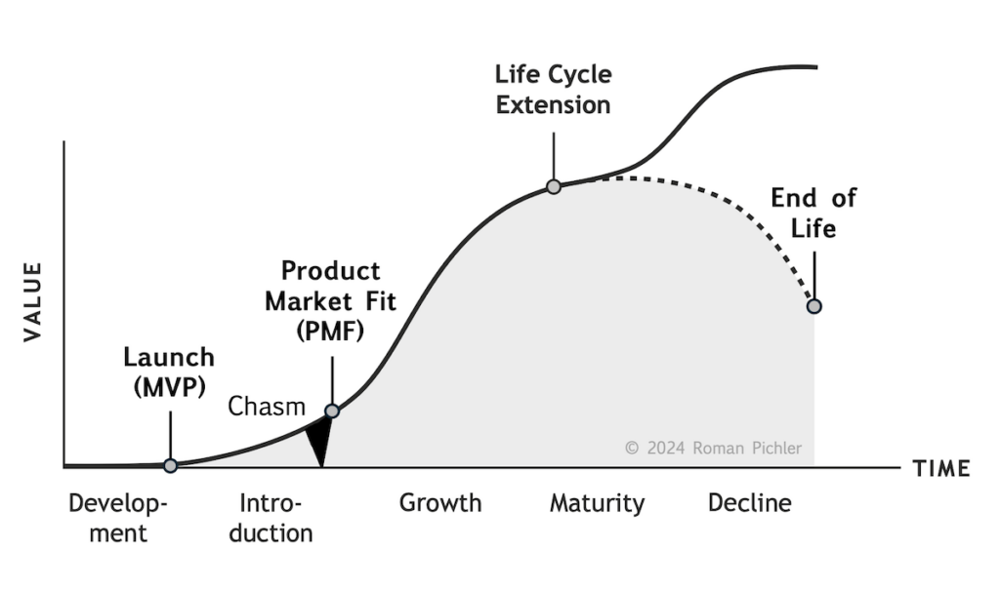
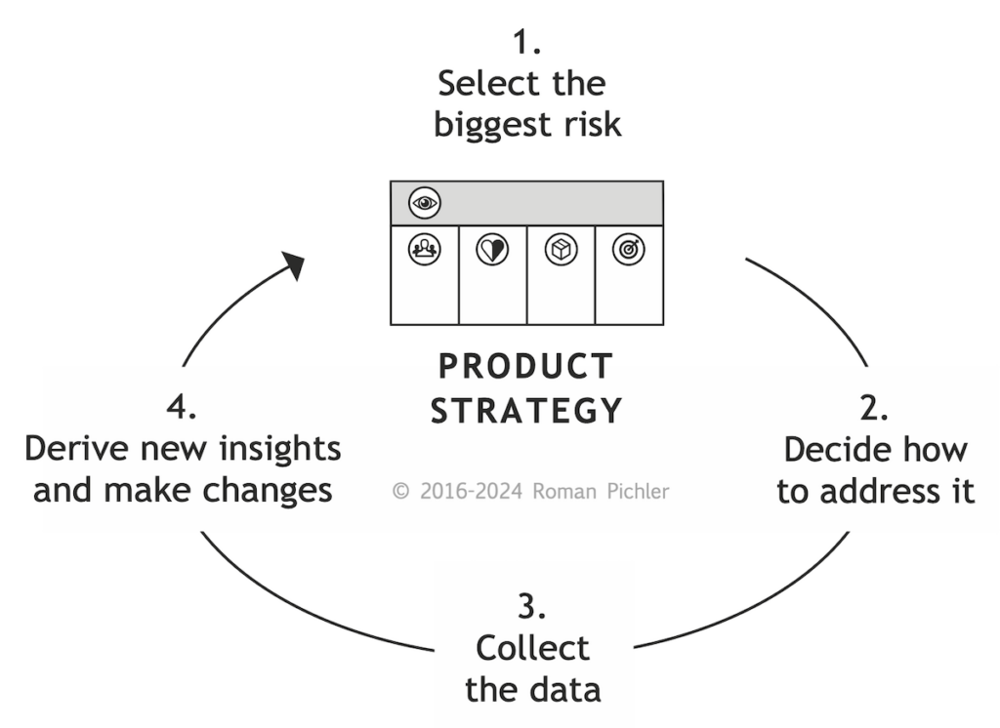
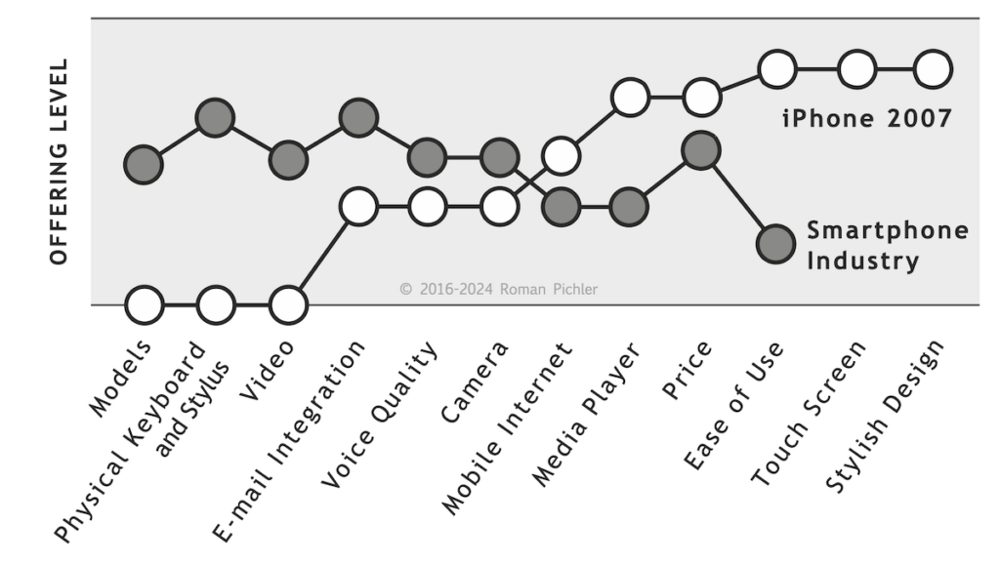
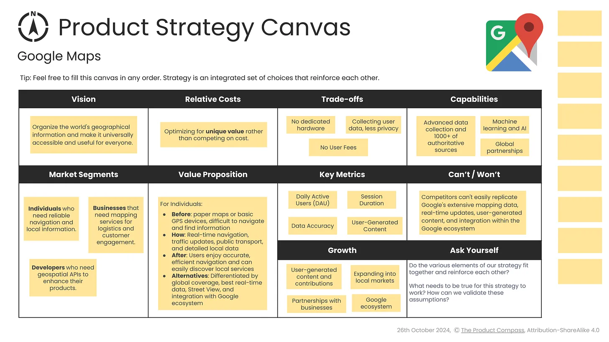
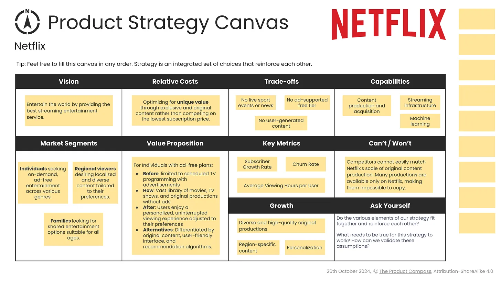
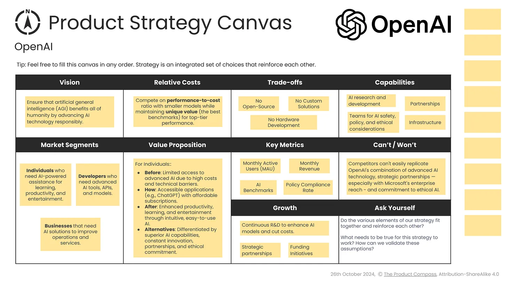

توسعه یک راهبرد محصول برنده سخت است. مرتبط نگه داشتن راهبرد و دستیابی به موفقیت مداوم محصول حتی سخت‌تر است.

## مدل چرخه عمر محصول
[منبع](https://www.romanpichler.com/blog/the-product-strategy-and-the-product-life-cycle/)

همانطور که از نام آن پیداست، مدل چرخه عمر محصول چگونگی توسعه یک محصول در طول زمان را توصیف می‌کند. فرض می‌کند که محصول زندگی بسیار شبیه یک موجود زنده دارد. یک محصول متولد یا عرضه (launch) می‌شود. سپس توسعه پیدا می‌کند، رشد می‌کند و بالغ می‌شود. در یک نقطه، کاهش می‌یابد، و در نهایت، می‌میرد. در نتیجه، دارای پنج مرحله است: توسعه (development)، معرفی (introduction)، رشد (growth)، بلوغ (maturity) و زوال (decline).

اما این تنها راهی نیست که یک محصول (عمر) می‌تواند داشته باشد. به جای اینکه بلوغ را بپذیرید و اجازه دهید محصولتان به خوبی پیر شود، می‌توانید تلاش کنید آن را جوان کرده و چرخه عمر آن را افزایش دهید. بنابراین تصویر بالا شامل یک چرخه زندگی دوم و کوچک‌تر است که به چرخه نخست می‌رسد. محصولات در واقع می‌توانند از تمدید مکرر چرخه عمر بهره‌مند شوند.
علاوه بر پنج مرحله، شکل بالا شامل چهار رویداد مهم در زندگی یک محصول است:
- **راه‌اندازی:** یک محصول اولیه، حداقل محصول قابل دوام (MVP)، در دسترس قرار گرفتن.
- **محصول مناسب بازار (PMF):** محصول آماده خدمت به بازار اصلی است.
- **تمدید چرخه عمر:** به عنوان مثال، با بردن آن به بازار جدید، عمر محصول طولانی می‌شود.
- **پایان عمر:** تولید محصول متوقف شده است.
در حالی که منحنی در تصویر تقریباً به شکل زنگ است، مسیر واقعی محصول شما ممکن است به طور قابل توجهی متفاوت باشد: ممکن است شیب آن بسیار بیشتر یا کمتر باشد. بنابراین مدل چرخه عمر ابزاری پیش‌بینی کننده نیست که ارزش تولید یک محصول را پیش‌بینی کند. این یک حس منطقی است که به شما کمک می‌کند بفهمید یک محصول در چرخه عمر خود کجا قرار دارد. برای استفاده از آن، باید ارزشی را که محصول شما ایجاد می‌کند تعریف کنید و در طول زمان آن را دنبال کنید. اولی با کشف یک راهبرد محصول موثر انجام می‌شود. مورد دوم با استفاده از شاخص‌های عملکرد کلیدی مناسب (KPI) به دست می‌آید.
### چهار مزیت برای اتخاذ تصمیمات راهبردی درست در مورد محصول
مدل چرخه عمر محصول چهار مزیت خاص را ارائه می‌دهد تا به شما کمک کند تصمیمات راهبردی درستی برای محصول خود بگیرید.
- **تمرکز**: این مدل به شما کمک می‌کند تا بر روی راهبرد (strategy) متمرکز شده و خود را با آن تطبیق دهید. به عنوان مثال، در مرحله توسعه، راهبرد شما باید به شما در راه‌اندازی (launch) کمک کند. در مرحله معرفی، تمرکز آن باید دستیابی به PMF باشد.
- **تلاش**: این چارچوب (framework) به شما کمک می‌کند تا تلاش لازم برای راهبرد را ارزیابی کنید. به ویژه در بخش توسعه تلاش زیاد است، زیرا باید یک راهبرد موثر پیدا کنید. این ممکن است به چندین هفته کار تحقیقاتی و آزمایشی نیاز داشته باشد. این را با مرحله بلوغ مقایسه کنید، جایی که بعید است راهبرد تغییرات مهمی را تجربه کند.
- **طرز فکر:** مراحل اولیه چرخه عمر شما را ملزم به انجام یک بازی تهاجمی می‌کند که در آن ابتکار عمل را به دست می‌گیرید، ذهنیت کارآفرینی را در آغوش می‌گیرید و می‌خواهید آگاهانه ریسک کنید. اما هنگامی که بلوغ را پذیرفتید، می‌خواهید دفاع خود را محکم کنید، از موقعیت محصول محافظت کنید و بر کارایی تمرکز کنید.
- **نوآوری:** آگاهی از اینکه محصولات در کدام مرحله از چرخه عمر خود قرار دارند به سازمان‌ها این امکان را می‌دهد تا portfolio خود را متعادل کنند، به‌موقع در محصولات جدید سرمایه‌گذاری کنند و محصولات در حال افول را کنار بگذارند.
### راهبرد محصول در مرحله توسعه
هنگامی که قصد دارید یک محصول جدید ایجاد کنید، راهبرد شما باید بر نیازهای بازار اولیه — نوآوران و پذیرندگان اولیه — متمرکز باشد. این افراد از استفاده از یک محصول اولیه و کافی (حداقل محصول قابل پذیرش یا MVP) خوشحال هستند و تا زمانی که استفاده از آن مزیتی برایشان به همراه داشته باشد، با چند مشکل ابتدایی کنار می‌آیند.
به عنوان مثال، آیفون اصلی را در نظر بگیرید. اپل یک بخش بازار متمرکز را هدف قرار داد — مصرف‌کنندگانی که قبلاً محصولات اپل را داشته یا استفاده کرده بودند و توانایی پرداخت تا ۵۰۰ دلار برای یک گوشی جدید را داشتند. این امر به شرکت اجازه داد تا محصولی نوآورانه را در بازه زمانی نسبتاً کوتاهی توسعه دهد، بدون اینکه مجبور باشد همه ویژگی‌هایی که رقبایی مانند بلک‌بری و نوکیا ارائه می‌دادند را تطبیق دهد.
یک روش عالی برای کشف استراتژی محصول جدید، پیروی از فرآیندی تکراری مانند آنچه در تصویر زیر نشان داده شده است، می‌باشد.

با ثبت راهبرد اولیه محصول خود شروع کنید. سپس به طور سیستماتیک آن را بازبینی کنید تا زمانی که تمام ریسک‌های اصلی موجود در آن را برطرف کنید، به عنوان مثال، اینکه نیاز اصلی به اندازه کافی قوی نیست و داده‌های مربوطه را برای نشان دادن اینکه گروه هدف، نیازها، اهداف تجاری و ویژگی‌های برجسته به احتمال زیاد درست هستند، جمع‌آوری کرده باشید.
### راهبرد محصول در مرحله معرفی
پس از اینکه MVP خود را عرضه کردید و وارد مرحله معرفی شدید، عملکرد محصول را با استفاده از شاخص‌های کلیدی عملکرد (KPI) مناسب ردیابی کنید. اگر پاسخ بازار ضعیف بود، علل آن را بررسی کرده و اقدامات اصلاحی مناسب را تعیین کنید. این ممکن است نیازمند تغییر اساسی در راهبرد — یک تغییر مسیر یا چرخش — باشد. به عنوان مثال، یوتیوب که از یک سایت قرار ملاقات ویدیویی به یک محصول اشتراک‌گذاری ویدیو تکامل یافت و یا اپل واچ که به‌عنوان یک گجت سبک زندگی و لوازم جانبی آیفون عرضه شد و به دستگاهی برای سلامت و تناسب اندام تبدیل شد.
اگر تغییر مسیر ممکن نیست یا قبلاً یک یا دو بار تغییر مسیر داده‌اید، باید به فکر کنار گذاشتن محصول خود باشید. اگرچه این ممکن است بسیار شدید به نظر برسد، اما منابع را آزاد کرده و از هدر دادن زمان، پول و انرژی جلوگیری می‌کند. برای مثال، گوگل ویو، ابزاری برای پیام‌رسانی و همکاری که در سال ۲۰۰۹ راه‌اندازی شد، به دلیل عدم موفقیت در مرحله معرفی حدود یک سال پس از عرضه متوقف شد.
اگر پاسخ مثبت بازار به محصول تازه عرضه شده خود مشاهده کردید، عالی است. اما اشتباه نکنید که محصول را برای بازار اولیه بهینه‌سازی کنید. در عوض، تمرکز خود را به کاربران/مشتریان اصلی و نیازهای آن‌ها تغییر دهید. این کار نیازمند تغییر استراتژی محصول و بازنگری بخش‌های مختلف آن از جمله گروه هدف و نیازها است.
ممکن است نیاز باشد ویژگی‌هایی را اضافه یا بهبود دهید، معماری و زیرساخت فناوری را تغییر دهید و مدل کسب‌وکار پایه را به‌روزرسانی کنید تا فاصله یا شکاف بین مراحل معرفی و رشد را پر کنید. دوباره آیفون را مثال بزنیم. برای ورود به مرحله رشد، اپل برنامه‌های شخص ثالث ارائه داد و شروع به فروش محصول در فروشگاه‌های خود و فروشگاه آنلاین کرد — تنها چند نمونه از این تغییرات.
### راهبرد محصول در مرحله رشد
وقتی یک محصول شروع به تولید ارزش قابل توجهی می‌کند، به تطابق محصول با بازار (product-market fit) دست یافته و وارد مرحله رشد می‌شود. در این مرحله باید راهبرد محصول را برای حفظ رشد و جذب کاربران و مشتریان بیشتر تطبیق دهید. با این حال، این کار بدون چالش نخواهد بود. در ادامه به دو چالش رایج اشاره می‌کنیم:
یک، اکنون محصولی دارید که به یک مخاطب بزرگ‌تر و ناهمگون‌تر با نیازهای متنوع خدمت می‌کند، ویژگی‌های بیشتری به آن اضافه شده و برای توسعه آن به تیم‌های بیشتری نیاز است. برای رفع این چالش، ممکن است محصول خود را به بخش‌های کوچک‌تر تقسیم کنید و یک یا چند ویژگی را جدا کرده و به یک محصول جدید تبدیل کنید — همان کاری که فیسبوک در سال ۲۰۱۴ با مسنجر انجام داد. در روش دیگر، می‌توانید انواع محصول ایجاد کرده و نسخه‌های خاصی از محصول خود را برای یک بخش خاص از بازار توسعه دهید، مانند یوتیوب کودکان.
دوم، احتمالاً رقبا شروع به رونوشت کردن برخی از ویژگی‌های محصول خواهند کرد. برای مثال، طراحی آیفون اصلی که زمانی یک تفاوت بزرگ محسوب می‌شد، اکنون به استاندارد تمام گوشی‌های مدرن تبدیل شده است. بنابراین، باید از محصول خود در برابر رقبا دفاع کرده و آن را به وضوح متمایز نگه دارید. ابزاری عالی برای این کار *راهبرد canvas* است که از راهبرد اقیانوس آبی نشأت گرفته است.

راهبرد canvas در شکل بالا آیفون اولیه را در مقابل رقبای خود، از جمله نوکیا N95 و بلک‌بری Curve، با استفاده از دوازده عامل کلیدی رتبه‌بندی می‌کند. با ارزیابی اینکه تا چه اندازه آیفون و محصولات رقبا این عوامل را برآورده می‌کنند، دو خط ایجاد می‌شود. این واقعیت که این خطوط از هم فاصله دارند نشان می‌دهد که آیفون اولیه بسیار خوب متمایز شده بود.
اگر راهبرد canvas را برای محصول خود به کار ببرید و تصویر مشابه‌ای به دست آورید، عالی است. اما اگر خطوط به هم نزدیک یا حتی روی هم قرار بگیرند، می‌دانید که محصول شما دیگر به‌طور مؤثری متمایز نیست. در نتیجه، باید راه‌هایی پیدا کنید تا دوباره آن را برجسته کنید — همان‌طور که اپل در سال ۲۰۱۷ این کار را انجام داد و ویژگی Face ID را اضافه کرد تا کاربران بتوانند با استفاده از فناوری تشخیص چهره دستگاه‌های خود را باز کنند.
### راهبرد محصول در مرحله بلوغ
علیرغم تمام تلاش‌های شما، رشد در نهایت شروع به کند شدن می‌کند و محصول شما وارد مرحله بلوغ می‌شود. هنگامی که این اتفاق می‌افتد، با یک نقطه تصمیم‌گیری راهبردی مهم با دو گزینه مواجه می‌شوید.
گزینه یک شما این است که چرخه عمر محصول را گسترش دهید. این کار نیازمند بازبینی راهبرد محصول است. فرض کنید تصمیم می‌گیرید با خدمت به یک بازار یا بخش جدید یا با پاسخگویی به یک نیاز جدید، رشد بیشتری داشته باشید، در این صورت باید گروه هدف را تغییر داده و نیازهایی که در راهبرد ثبت شده‌اند را اصلاح کنید.
توجه داشته باشید که به‌روزرسانی بزرگ‌تر راهبرد احتمالاً ریسک‌های جدیدی را به همراه خواهد داشت. بنابراین باید فرآیندی را که در تصویر ۲ نشان داده شده است دنبال کرده و به‌طور سیستماتیک این ریسک‌ها را قبل از تعهد به راهبرد برطرف کنید.
گزینه دوم این است که اجازه دهید محصول شما به بلوغ برسد و از آن به‌عنوان یک محصول گاو شیرده استفاده کنید. چنین محصولی مزایای تجاری زیادی ایجاد می‌کند، اما به سرمایه‌گذاری متوسط تا کم نیاز دارد. این گزینه زمانی توصیه می‌شود که نیازی به گسترش چرخه عمر وجود نداشته باشد. این بدان معناست که شما محصولات دیگری در دست توسعه دارید که در نهایت جایگزین محصول شما خواهند شد.
اگر گزینه دوم را انتخاب می‌کنید، راهبرد محصول را تطبیق دهید، مثلاً با تنظیم اهداف تجاری و معرفی هدف سودآوری. از آنجایی که اکنون ذهنیت محافظه‌کارانه‌تری در پیش می‌گیرید، یک رویکرد دفاعی داشته باشید و بر روی بهبودهای جزئی و رفع اشکال تمرکز کنید، راهبرد محصول باید نسبتاً پایدار باشد. با این حال، باید راهبردسازی مستمر را تمرین کنید، عملکرد محصول را پیگیری کنید، بازار و رقبا را رصد کنید و به‌طور منظم بررسی کنید که آیا راهبرد فعلی همچنان مؤثر است یا خیر.
### راهبرد محصول در مرحله زوال

حتی اگر در مدیریت یک محصول بالغ عملکرد بسیار خوبی داشته باشید، روزی فرا می‌رسد که محصول شما وارد مرحله زوال شود — ارزشی که ایجاد می‌کند شروع به کاهش می‌کند. به عنوان مثال، آیپاد اصلی یا آیپاد کلاسیک را در نظر بگیرید. این محصول زمانی بر دسته‌بندی خود مسلط بود و منبع درآمد مهمی برای اپل محسوب می‌شد. پس از سال‌ها کاهش فروش، شرکت در سال ۲۰۱۴ آن را بازنشسته کرد.
هنگامی که محصول شما وارد مرحله زوال می‌شود، دوباره دو گزینه اصلی پیش روی خود دارید: گزینه یک این است که این مرحله را به‌عنوان پایان چرخه عمر محصول بپذیرید. در این مرحله نباید انتظار تغییرات زیادی در راهبرد محصول داشته باشید، مگر اینکه تصمیم به فروش یا صدور مجوز بخش‌هایی از محصول بگیرید که در این صورت نیاز به تنظیم اهداف تجاری خواهید داشت.
از طرف دیگر، ممکن است بخواهید با تغییر موقعیت محصول، آن را به‌عنوان یک محصول تخصصی و در حاشیه بازار دوباره احیا کنید. به عنوان مثال، صفحه‌گردان‌ها (turntables) را در نظر بگیرید که پس از تقریباً انقراض کامل این دسته‌بندی، بازگشتی چشمگیر داشته‌اند. اگر این گزینه را انتخاب کردید، راهبرد محصول را بازبینی کرده و گروه هدف، نیازها، اهداف تجاری و ویژگی‌های برجسته را تغییر دهید. از آنجا که تغییرات بزرگی در راهبرد ایجاد کرده‌اید، آن را با استفاده از فرآیند نشان داده شده در تصویر ۲ اعتبارسنجی کنید.

## نمونه‌ها
در این بخش نمونه‌هایی از راهبرد محصولات ثبت شده است. [منبع](https://www.productcompass.pm/p/product-strategy-examples)
### نقشه گوگل
1. چشم‌انداز
	سازماندهی اطلاعات جغرافیایی جهان و فراهم کردن دسترسی جهانی و مفید برای همه.
2. بخش‌های بازار
	- افرادی که نیاز به ناوبری قابل‌اعتماد و اطلاعات محلی دارند.
	- کسب‌وکارهایی که به خدمات نقشه‌برداری برای لجستیک و تعامل با مشتری نیاز دارند.
	- توسعه‌دهندگانی که به API‌های مکانی برای بهبود محصولاتشان نیاز دارند.
3. هزینه‌های نسبی
	- بهینه‌سازی برای ارائه ارزش منحصربه‌فرد به‌جای رقابت بر سر هزینه.
4. پیشنهاد ارزش
	برای افرادی که نیاز به ناوبری قابل‌اعتماد و اطلاعات محلی دارند:
	- قبل: مردم به نقشه‌های کاغذی یا دستگاه‌های GPS ساده تکیه می‌کردند که منجر به مسیرهای نادرست و مشکل در پیدا کردن خدمات محلی می‌شد.
	- چگونه: Google Maps ناوبری در لحظه، به‌روزرسانی‌های ترافیک، اطلاعات حمل‌ونقل عمومی و داده‌های دقیق کسب‌وکارهای محلی را در دستگاه‌های مختلف فراهم می‌کند.
	- بعد: کاربران از ناوبری دقیق و کارآمد لذت می‌برند و به‌راحتی کسب‌وکارها و خدمات محلی را کشف و با آن‌ها تعامل می‌کنند.
	- جایگزین‌ها: تفاوت در پوشش جهانی، داده‌های در لحظه، Street View و ادغام با دیگر خدمات گوگل مانند جستجوی گوگل و دستیار گوگل.
5. معاوضه‌ها
	- عدم ارائه سخت‌افزار اختصاصی: تمرکز صرف بر راه‌حل‌های نرم‌افزاری.
	- جمع‌آوری داده برای خدمات: جمع‌آوری داده‌های کاربران برای بهبود خدمات که ملاحظات حریم خصوصی را به دنبال دارد.
	- عدم هزینه برای کاربران: کسب درآمد از طریق تبلیغات و پیشنهادات سازمانی به‌جای دریافت هزینه مستقیم از کاربران.
6. شاخص‌های کلیدی
	- کاربران فعال روزانه (DAU): تعداد کاربران منحصربه‌فرد روزانه.
	- مدت زمان جلسه: میانگین زمان صرف‌شده در هر جلسه برای ارزیابی تعامل کاربر.
	- دقت داده‌ها: دقت داده‌های نقشه با نظارت بر گزارش‌های خطا و زمان حل آن‌ها.
	- محتوای تولیدشده توسط کاربران: حجم و کیفیت مشارکت‌های کاربران مانند نظرات، عکس‌ها و ویرایش‌های نقشه.
7. رشد
	- محتوای تولیدشده توسط کاربران: تشویق کاربران به افزودن نظرات، عکس‌ها و بینش‌های محلی از طریق برنامه‌هایی مانند Local Guides.
	- گسترش به بازارهای محلی: محلی‌سازی محتوا و ویژگی‌ها برای رفع نیازها و ترجیحات منطقه‌ای.
	- همکاری با کسب‌وکارها: همکاری با کسب‌وکارهای محلی برای بهبود فهرست‌ها و ارائه اطلاعات دقیق.
	- ادغام با اکوسیستم گوگل: بهره‌گیری از دیگر خدمات گوگل (مانند جستجو و دستیار گوگل) برای افزایش تعامل کاربران.
8. قابلیت‌ها
	- جمع‌آوری داده‌های پیشرفته: استفاده از داده‌های بیش از ۱۰۰۰ منبع معتبر برای نقشه‌برداری جامع.
	- یادگیری ماشین و هوش مصنوعی: استفاده از هوش مصنوعی برای بهبود ناوبری، پیش‌بینی ترافیک و ارتقای تجربه کاربر.
	- همکاری‌های جهانی: همکاری با دولت‌ها، سازمان‌های حمل‌ونقل و کسب‌وکارهای سراسر جهان برای بهبود کیفیت داده‌ها.
9. چیزهایی که نمی‌توانند / نمی‌خواهند
	رقبا به‌راحتی نمی‌توانند داده‌های گسترده نقشه‌برداری، به‌روزرسانی‌های در لحظه، مشارکت‌های تولیدشده توسط کاربران و ادغام درون اکوسیستم گوگل را بدون سرمایه‌گذاری قابل‌توجه و توسعه فناوری بازتولید کنند.

### نتفلیکس
1. چشم‌انداز
	سرگرم کردن دنیا با ارائه بهترین خدمات پخش آنلاین.
2. بخش‌های بازار
	- افرادی که به سرگرمی بدون تبلیغ و بر اساس تقاضا در ژانرهای مختلف نیاز دارند.
	- بینندگانی که محتوای محلی و متنوع متناسب با ترجیحاتشان می‌خواهند.
	- خانواده‌هایی که به دنبال گزینه‌های سرگرمی مشترک مناسب برای تمام سنین هستند.
3. هزینه‌های نسبی
	بهینه‌سازی برای ارائه ارزش منحصربه‌فرد از طریق محتوای اختصاصی و اصلی به‌جای رقابت با پایین‌ترین قیمت اشتراک.
4. پیشنهاد ارزش
	برای افرادی با طرح‌های بدون تبلیغ:
	- قبل: مخاطبان محدود به برنامه‌های تلویزیونی زمان‌بندی شده با تبلیغات و دسترسی محدود به محتوای متنوع بودند.
	- چگونه: کتابخانه بزرگی از فیلم‌ها، سریال‌ها و تولیدات اختصاصی که هر زمان و بدون تبلیغات در دستگاه‌های مختلف قابل دسترسی هستند.
	- بعد: کاربران تجربه‌ای شخصی‌سازی‌شده و بدون وقفه از تماشا که با ترجیحات (preferences) آن‌ها تطبیق دارد، لذت می‌برند.
	- جایگزین‌ها: تمایز با تولیدات اختصاصی، رابط کاربری ساده و الگوریتم‌های پیشنهاددهی.
5. معاوضه‌ها
	- پخش زنده تلویزیونی: ارائه پخش زنده ورزشی یا خبری ندارد.
	- طرح رایگان: از ارائه گزینه رایگان با تبلیغ خودداری می‌کند تا تجربه کاربری ممتاز حفظ شود.
	- محتوای تولیدشده توسط کاربر: از محتوای تولیدشده توسط کاربران اجتناب می‌کند تا کنترل کیفیت حفظ شود.
6. شاخص‌های کلیدی
	- نرخ رشد مشترکین: درصد افزایش ماهانه یا فصلی مشترکین پولی جهانی (مثلاً ۱۰٪ رشد فصلی).
	- نرخ ریزش: درصد مشترکینی که هر ماه اشتراک خود را لغو می‌کنند، با هدف نگه داشتن آن زیر یک حد مشخص (مثلاً زیر ۲٪ ماهانه).
	- میانگین ساعات تماشا به ازای هر کاربر: محاسبه میانگین ساعات پخش شده به ازای هر کاربر در هفته برای ارزیابی میزان تعامل (مثلاً هدف ۱۰ ساعت در هفته).
7. رشد
	- تولید محتوای اختصاصی: سرمایه‌گذاری در تولیدات متنوع و با کیفیت برای جذب مشترکین جدید.
	- گسترش بازار: ورود به بازارهای بین‌المللی جدید با محتوای محلی.
	- شخصی‌سازی پیشرفته: استفاده از یادگیری ماشین برای شخصی‌سازی تجربه کاربری.
8. قابلیت‌ها
	- تولید و کسب محتوا: تولید و خرید محتوای جذاب اختصاصی.
	- زیرساخت پخش: فناوری برای پخش با کیفیت و مطمئن.
	- یادگیری ماشین: استفاده از یادگیری ماشین برای ارائه پیشنهادهای محتوایی شخصی‌سازی‌شده.
9. نمی‌تواند/نمی‌خواهد
	رقبا به‌راحتی نمی‌توانند مقیاس تولید محتوای اختصاصی و سیستم پیشرفته پیشنهاددهی Netflix را تکرار کنند. بسیاری از تولیدات فقط در Netflix موجود هستند و کپی‌برداری از آن‌ها غیرممکن است.

### اوپن‌ای‌آی
1. چشم‌انداز
	اطمینان از اینکه هوش مصنوعی عمومی (AGI) به نفع تمام بشریت است از طریق پیشرفت مسئولانه در فناوری AI.
2. بخش‌های بازار
	- افرادی که به دستیارهای مبتنی بر AI برای یادگیری، بهره‌وری و سرگرمی نیاز دارند.
	- توسعه‌دهندگانی که به ابزارها، APIها و مدل‌های پیشرفته AI نیاز دارند.
	- کسب‌وکارهایی که به راهکارهای AI برای بهبود عملیات و خدمات نیاز دارند.
3. هزینه‌های نسبی
	رقابت بر اساس نسبت عملکرد به هزینه با مدل‌های کوچک‌تر در حالی که ارزش منحصربه‌فرد (بهترین امتیازات) برای عملکرد سطح بالا را حفظ می‌کند.
4. پیشنهاد ارزش
	برای افرادی که به دستیارهای مبتنی بر AI نیاز دارند:
	- قبل: دسترسی محدود به هوش مصنوعی پیشرفته به دلیل هزینه‌های بالا و موانع فنی.
	- چگونه: برنامه‌های قابل‌دسترسی (مانند ChatGPT) با اشتراک‌های مقرون‌به‌صرفه.
	- بعد: افزایش بهره‌وری، یادگیری و سرگرمی از طریق AI کاربرپسند و آسان برای استفاده.
	- جایگزین‌ها: تمایز با توانایی‌های برتر AI، همکاری‌های استراتژیک، نوآوری مستمر و تعهد اخلاقی.
5. معاوضه‌ها
	- مدل‌های متن‌باز: مدل‌های پیشرفته اختصاصی باقی می‌مانند.
	- راهکارهای سفارشی: تمرکز بر AI عمومی و چندمنظوره به جای سفارشی‌سازی‌های خاص.
	- توسعه سخت‌افزار: اتکا به شرکا برای نیازهای زیرساختی به جای توسعه سخت‌افزار اختصاصی.
6. شاخص‌های کلیدی
	- درآمد ماهانه: درآمد ماهانه از اشتراک‌ها و هزینه‌های مبتنی بر استفاده.
	- کاربران فعال ماهانه (MAU): میزان تعامل کاربران در پلتفرم‌های مختلف.
	- امتیازات AI: حفظ عملکرد سطح بالا در مجموعه داده‌های استاندارد صنعتی و اطمینان از نسبت عملکرد به هزینه رقابتی.
	- نرخ رعایت سیاست‌ها: اطمینان از رعایت دستورالعمل‌های ایمنی.
7. رشد
	- نوآوری: تحقیق و توسعه مستمر برای بهبود مدل‌های AI و کاهش هزینه‌ها.
	- همکاری‌های راهبردی: استفاده از همکاری‌ها (مثلاً با مایکروسافت) برای منابع و ادغام در پلتفرم‌های پرکاربرد.
	- طرح‌های سرمایه‌گذاری: جذب سرمایه‌گذاری‌های بیشتر برای حمایت از رشد و انتقال به یک مدل سودآور پایدار.
8. قابلیت‌ها
	- تحقیق و توسعه AI: توانمندی‌های تحقیق و توسعه در سطح جهانی.
	- همکاری‌های راهبردی: همکاری‌های قوی برای توسعه فناوری و دسترسی به بازار.
	- زیرساخت: سیستم‌های مقیاس‌پذیر برای آموزش و پیاده‌سازی مدل‌های بزرگ AI.
	- اخلاق و ایمنی: تیم‌های اختصاصی برای اطمینان از AI اخلاقی و ایمن.
9. نمی‌تواند/نمی‌خواهد
	رقبا به‌راحتی نمی‌توانند ترکیب فناوری پیشرفته AI، همکاری‌های راهبردی — به‌ویژه با گستره‌ی سازمانی مایکروسافت — و تعهد به AI اخلاقی OpenAI را بدون سرمایه‌گذاری و تخصص قابل‌توجه تکرار کنند.

