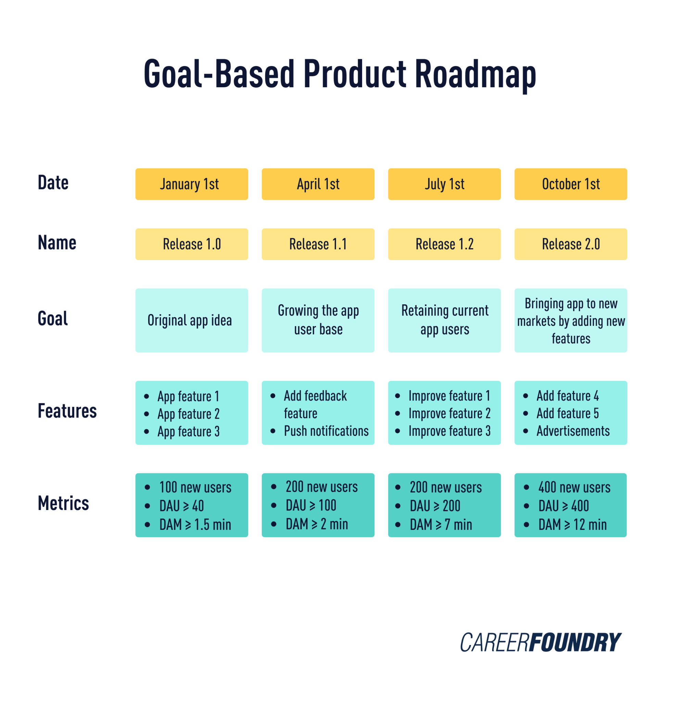
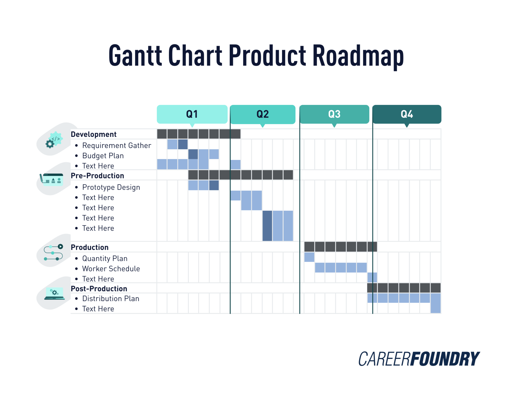
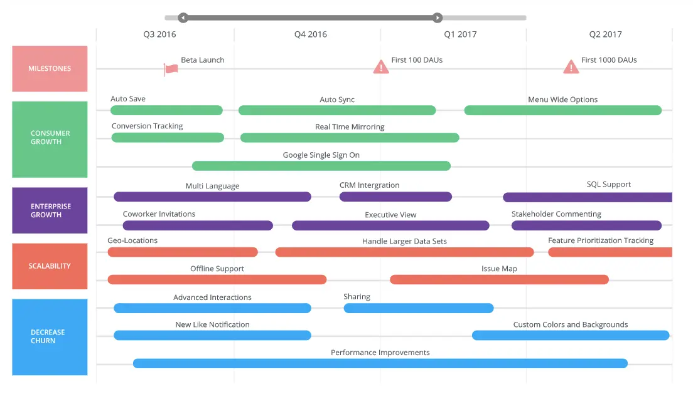

# نقشه‌راه

ایجاد و حفظ یک محصول موفق کار ساده‌ای نیست. این شامل متعادل کردن اهداف راهبردی محصول با نیازهای کاربران نهایی آن و همچنین انتظارات ذینفعان داخلی است. [منبع](https://careerfoundry.com/en/blog/product-management/product-roadmap-guide)

## نقشه‌راه محصول چیست؟
نقشه‌راه محصول (product roadmap) یک ابزار راهبردی سطح بالاست، نقشه راه محصول برای توصیف چشم‌انداز و جهت یک محصول یا خدمات استفاده می‌شود. ویژگی‌ها و عملکردهای پیش‌بینی‌شده محصول و دوره زمانی مورد انتظار تحویل آن‌ها را مشخص می‌کند.
هدف نقشه راه محصول انتقال یک راهبرد (strategy) و جهت مشترک به ذینفعان سازمان است. از آنجایی که آن‌ها نسبتاً سطح بالایی دارند (برخلاف اسناد راهبردی، که بر وظایف ریز مورد نیاز در طول توسعه محصول تمرکز دارند)، نقشه‌های راه محصول بسیار انعطاف‌پذیرتر و چابک‌تر هستند. این بدان معناست که آن‌ها به خوبی با تغییرات سازگار می‌شوند.
یک نقشه راه معمولاً توسعه محصول را در حدود ۱۲ تا ۱۸ ماه خلاصه می‌کند و از تصاویر واضح برای نمایش عناصر زیر استفاده می‌کند:
- چشم‌انداز محصول: چشم‌انداز محصول بیانیه‌ای واضح و مختصر است که اهداف کلی محصول شما را بیان می‌کند. باید بلند پروازانه اما قابل دستیابی باشد - چیزی که همه اعضای تیم توسعه محصول می‌توانند از آن حمایت کنند.
- اهداف: اهداف مشخص می‌کنند که محصول در تلاش است به چه چیزی دست یابد. آن‌ها معمولاً شامل فهرستی از اظهارات همسو با راهبرد کلی شرکت هستند. برای اطمینان از معنی دار بودن آن‌ها، گاهی اوقات از یادداشت مدیریت پروژه "SMART" پیروی می‌کنند. این به معنای خاص، قابل اندازه گیری، قابل دستیابی، مرتبط و محدود به زمان است.
- ابتکارات: ابتکارات (در سطح بالایی) پروژه‌های چند کارکردی را توصیف می‌کنند که باید برای دستیابی به اهداف نقشه راه محصول انجام شوند. در حالی که این موارد به جزئیات نمی‌پردازند، با این وجود برای نظارت بر مسئولیت‌های پروژه به اعضای مختلف تیم مفید هستند.
- جدول زمانی: جدول زمانی نمایش تصویری نقشه راه محصول است. باید زمان شروع و پایان هر ابتکار را مشخص کند. اغلب برای سهولت در شناسایی دسته‌های مختلف کد رنگی دارد.
- وابستگی‌ها: جدول زمانی بصری اغلب وابستگی‌های پروژه را برجسته می‌کند. این لیستی از کارهایی است که باید قبل از شروع مرحله بعدی تکمیل شوند. به عنوان مثال، ممکن است لازم باشد قبل از ایجاد ویژگی‌هایی که به آن جزء متکی هستند، یک جزء نرم‌افزاری خاص را توسعه دهید.
### چرا نقشه راه محصول مهم است؟
-  کمک می کند تا اطمینان حاصل شود که همه در جهت یک هدف کار می‌کنند.
- تیم‌های محصول را بر روی اینکه کدام جنبه از پروژه مهم است متمرکز می‌کند.
- به مدیر محصول کمک می‌کند ویژگی‌ها، وظایف و زمان بندی انتشار را اولویت‌بندی کند.
- از آنجا که با پیشرفت توسعه محصول تغییر می‌کند، روشی مختصر برای به‌روز نگه داشتن ذینفعان در مورد پیشرفت است.
- برای ردیابی و اندازه گیری معیارهای موفقیت ضروری است.

## انواع نقشه‌راه محصول
### نقشه‌راه انتشار
نقشه‌راه انتشار (release roadmap) یک نمای کلی از نسخه‌های آینده را ارائه می‌دهد. به عنوان یک راهنمای داخلی استفاده می‌شود و ذینفعان را در مورد پیشرفت محصول به‌روز نگه می‌دارد. معمولاً شامل تاریخ‌هایی برای هر نسخه می‌شود و ممکن است بر اساس تاریخ، محصول یا پروژه سازماندهی شود. همچنین شامل توضیحاتی در مورد هر ویژگی و اینکه آیا در حال توسعه، آزمایش یا آماده انتشار است، می‌باشد.
### نقشه‌راه فناوری
نقشه‌های راه فناوری نقاط عطف فناروی اصلی مورد نیاز برای تکمیل یک محصول جدید را مشخص می‌کند. معمولاً تیم‌های تولید و توسعه را هدف قرار می‌دهد. نقاط عطف ممکن است با اهداف خارجی سازمان (مانند ارائه ویژگی‌های خاص مشتری) یا اهداف داخلی (مانند استقرار استراتژی فناوری اطلاعات یک شرکت) همسو باشد.

### نقشه‌راه بازاریابی
نقشه‌راه بازاریابی یک ابزار راهنمایی است که برای اطلاع رسانی به تیم‌های مهندسی، پروژه، توسعه یا فروش در مورد فعالیت‌های بازاریابی مرتبط با محصول استفاده می‌شود. معمولاً شامل شرح مختصری از محصول، بازار هدف و برنامه‌ای از فعالیت‌ها و اهداف بازاریابی برنامه ریزی شده است. به عنوان مثال، ممکن است شامل جدول زمانی کمپین‌های دیجیتال و اهداف آن‌ها باشد.

### نقشه‌راه نمونه کارها
در حالی که پروژه‌های مجزا همیشه یک نقشه‌راه اختصاصی دارند، نقشه‌راه نمونه کارها (Portfolio) راهبردی و اهداف مجموعه وسیع‌تری از محصولات را به تصویر می‌کشد. این مجموعه از محصولات به عنوان یک سبد محصول یا معمولاً یک ترکیب محصول شناخته می‌شود. تمامی نقشه‌راه‌ها به طور منظم نیاز به بررسی و بروزرسانی دارند، اما این موارد برای نقشه‌راه نمونه کارها بسیار مهم است، به خاطر این است که شامل مجموعه پیچیده‌ای از پروژه‌ها هستند که هر کدام وابستگی‌ها و تیم مدیریت محصول خود را دارند.

### نقشه‌راه راهبردی
بسیاری از سازمان‌ها از نقشه‌راه راهبردی (strategy) خاصی برای ترسیم طرح‌های آتی خود استفاده می‌کنند. در حالی که نقشه‌راه محصول شامل برنامه‌هایی برای محصولات یا خدمات منتخب است، نقشه‌راه راهبردی شامل فعالیت‌های گسترده‌تری است. این شامل تغییرات در ساختار و فرآیندهای سازمان است، نه فقط تغییرات در محصولات و خدمات آن.

## نمونه نقشه‌راه محصول

### نقشه‌راه هدف محور

در این نقشه‌راه تاریخ انتشار، نام نسخه، هدف (مانند انتشار نسخه نخست، افزایش تعداد کاربران، نگهداری کاربران)، ویژگی‌ها و معیارهای سنجش وجود دارد. نقشه‌های راه مبتنی بر هدف برای پروژه‌های چابک ایده‌آل هستند، زیرا انعطاف‌پذیرتر و سازگارتر با تغییر هستند. و از آنجا که آن‌ها فرآیندهای خاصی را که نیاز به دنبال کردن دارند تجویز نمی‌کنند، امکان نوآوری بیشتری را فراهم می‌کنند.

### نقشه‌راه محصول گانت

در پروژه‌های پیچیده، بسیاری از مدیران محصول رویکرد مبتنی بر جدول زمانی را به نقشه‌راه محصول ترجیح می‌دهند. این به ویژه برای پروژه‌هایی که باید استانداردهای توسعه خاصی را رعایت کنند یا برای مدیریت سبد محصولاتی که وابستگی‌های متقابل زیادی دارند مفید است. این یک جدول زمانی بصری از وابستگی روابط بین فعالیت‌های مختلف پروژه ارائه می‌دهد. بیشتر دستور است تا یک نقشه راه مبتنی بر هدف.

### نقشه‌راه براساس ویژگی

در حالی که نقشه‌های راه ویژگی همیشه جدول زمانی دقیقی ندارند، اما برای برقراری ارتباط چگونگی پیشرفت یک محصول مفید هستند. نقشه‌راه ویژگی تیم‌های تولید را بر روی وظایف سطح بالا متمرکز نگه می‌دارد. نقشه‌راه ویژگی‌ها توسعه محصول را به جدول زمانی تقسیم می‌کند، اما این نقشه‌ها به اندازه موارد موجود در نمودار گانت مشخص نیستند.

## نحوه ایجاد نقشه راه محصول
برای ایجاد نقشه‌راه محصول سه گام زیر پیشنهاد می‌شود:

**گام نخست: یک تیم محصول چند رشته‌ای تشکیل دهید**
این تیم می‌تواند شامل مدیریت ارشد و هر کسی باشد که مستقیماً در توسعه محصول دخالت دارد.
- یک نماینده بازاریابی ممکن است بینشی در مورد مخاطب هدف شما، نیازهای آن‌ها، نقاط دردناک و بهترین روش متمایز کردن محصول شما از رقبا ارائه دهد.
- یک طراح به تعیین ویژگی‌های خاص محصول و آنچه که در ایده‌آل برای حمایت از مشتریان و اهداف شرکت شما باید انجام دهد، کمک می‌کند.
- یک توسعه‌دهنده وب یا نرم‌افزار راهنمایی روشنی در مورد آنچه عملاً در برابر طرح طراحی قابل دستیابی است و مدت زمانی که باید برای رسیدن به هر نقطه عطف توسعه طول بکشد، ارائه می‌کند.
- در نهایت، یک نماینده رهبری احتمالاً باید چشم انداز محصول نهایی را امضا کند تا مطمئن شود که از آن راضی است.
شما باید با کمک این تیم چشم‌انداز محصول خود را مشخص کنید. از بسیاری جهات، این مشکل‌ترین جنبه ایجاد نقشه محصول است. چشم‌انداز شما باید بیانیه کوتاهی از قصد باشد که با اهداف سازمان همسو باشد. با این حال، باید برای مخاطبان هدف شما نیز ارائه شود. در نهایت، باید همه اعضای تیم آن را درک کنند. چشم‌انداز می‌تواند شامل ویژگی‌های زیر باشد:
- مختصر: آن را تا آنجا که ممکن است در اصل نگه دارید. در حالت ایده آل، یک یا دو جمله.
- خاص: در مورد هدف خود شفاف باشید. متمرکز بمانید.
- آرزویی: خیلی ایمن بازی نکنید - آنچه را که تیم شما می‌تواند به دست آورد را گسترش دهید.
- عمل پذیر: آرزوها را با واقع‌گرایی در مورد آنچه واقعاً شدنی است متعادل کنید.
- مرز مشخص: در نهایت، چشم انداز محصول شما باید مرزهای روشنی داشته باشد. دید شما از کجا شروع و به کجا ختم می‌شود؟ جایی برای ابهام نیست. همه را بر روی کاری که در دست دارید متمرکز کنید.
به یاد داشته باشید چشم‌انداز شما باید چیزی به گونه‌ای باشد که هر عضو تیم بتواند در آن ثبت‌نام کرده و روی آن سرمایه‌گذاری کند.

**گام دوم: نقشه محصول خود را بسازید**
گام بعدی این است که تمام ورودی‌های خود را در یک نقشه‌راه محصول منسجم جمع آوری کنید. ایجاد و نگهداری نقشه راه محصول بر عهده مدیر محصول است. در حین پاسخ دادن به سوالات کلیدی باید سطح بالایی داشته باشد:
- برای رسیدن به چشم انداز خود چه اهدافی را باید در نظر بگیرید؟
- برای رسیدن به این اهداف چه گام‌های مشخصی باید برداشته شود و توسط چه تیم‌هایی؟
- چه معیارهایی برای ردیابی برای سنجش موفقیت محصول شما لازم است؟ نمونه‌هایی از معیارها می‌تواند AARRR (Pirate Metrics) باشد.
- چگونه این معیارها را جمع آوری می‌کنید؟
- آیا یک نمونه اولیه برای محصول خود ایجاد خواهید کرد؟
- اگر چنین است، چه ویژگی‌هایی را آزمایش می‌کند؟
- تیم باید از چه زمان‌بندی‌ها و وابستگی‌هایی آگاه باشد؟
در نهایت این وظیفه هر یک از اعضای تیم است که به عنوان یک مشاور متخصص عمل کند و اطمینان حاصل کند که راهبرد شما نیازهای همه را برآورده می‌کند، از تجزیه و تحلیل کسب و کار گرفته تا طراحی UX/UI و توسعه فنی.
نقشه محصول نهایی شما یک جدول زمانی بصری نسبتاً دقیق از چرخه توسعه محصول خواهد بود. این شامل وظایف طراحی و توسعه، از جمله ضرب‌الاجل‌ها، بودجه‌ها و وابستگی‌ها می‌شود. اما به یاد داشته باشید: این یک سند کار است و به طور کامل تنظیم نشده است. به طور مرتب نقشه‌راه محصول خود را بازبینی کنید تا مطمئن شوید که در مسیر درست قرار دارد. اگر بودجه تغییر کرد یا محدوده پروژه تغییر کرد، نقشه‌راه خود را بر این اساس تنظیم کنید.

**گام سوم: نقشه راه محصول خود را به اشتراک بگذارید**
در نهایت، باید اطمینان حاصل کنید که همه افراد درگیر در فرآیند توسعه محصول نقشه‌راه و مسئولیت‌های خود را درک می‌کنند.

##  نمونه‌ها
https://roadmunk.com/guides/7-product-roadmap-templates
